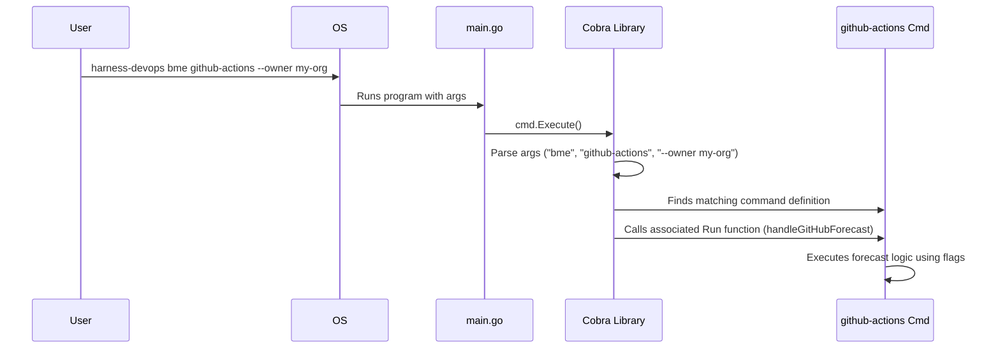

# Chapter 1: CLI Command Framework

Welcome to the `harness-devops-cli` tutorial! This tool helps you understand and forecast your build times and costs on platforms like Jenkins and GitHub Actions. But how do you actually *tell* the tool what you want it to do? That's where the **CLI Command Framework** comes in.

Think of using a command-line tool like ordering food at a restaurant. You need a way to see the menu, choose what you want, maybe add some special requests, and place your order. The CLI Command Framework is like the menu and the waiter combined – it defines *how* you interact with the `harness-devops-cli` tool.

Our main goal with this tool is often to get a forecast, for example: "Estimate the build times for my `my-app` repository within the `my-org` organization on GitHub Actions." The command framework lets us express this request clearly, like:

`harness-devops bme github-actions --owner my-org --repo my-app`

This chapter explains how this command structure works.

## What is the CLI Command Framework?

At its heart, the CLI Command Framework defines:

1.  **The main command:** The name of our tool (`harness-devops`).
2.  **Subcommands:** Specific actions the tool can perform (like `configure` to set things up, or `bme` to start an estimation).
3.  **Flags (or Options):** Extra details you provide to customize a command (like `--owner my-org` to specify the GitHub organization, or `--start-date 2023-01-01` to limit the data).

We use a popular Go library called **Cobra** to build this framework. Cobra acts like our helpful waiter:

*   It shows you the **menu** when you ask for help (`--help`).
*   It takes your **order** (the command you type with its subcommands and flags).
*   It **parses** your order, making sure you provided all the required information.
*   It delivers the order to the **kitchen** (calls the correct Go function inside our tool to do the work).

## Key Concepts

Let's break down the structure using our restaurant analogy:

*   **Root Command (`harness-devops`):** This is the main entry point, like the restaurant's name on the door. You always start with this.
*   **Subcommands (`configure`, `bme`, `github-actions`, `jenkins`):** These are like sections in the menu (e.g., "Appetizers", "Main Courses") or specific dishes.
    *   `configure`: A command to set up credentials.
    *   `bme` (Build Minutes Estimate): A *group* of commands related to forecasting. It doesn't do anything on its own, like just saying "Main Course" doesn't get you food.
    *   `github-actions` / `jenkins`: Specific actions *within* the `bme` group, like ordering the "Steak" or "Pasta" from the Main Course section. These trigger the actual forecast calculation.
*   **Flags (`--owner`, `--repo`, `--start-date`):** These are customizations for your order, like asking for "medium-rare" (`--owner my-org`) or "dressing on the side" (`--start-date 2023-01-01`). They provide specific details needed for a command.
*   **Help (`--help`):** This is like asking the waiter "What do you have?" or looking at the printed menu. It shows available commands, subcommands, and flags.

## How to Use the Framework

Using the tool involves typing commands in your terminal following this pattern:

`harness-devops [command_group] [specific_command] --flag1 value1 --flag2 value2`

**Example: Getting a GitHub Actions Forecast**

Let's revisit our goal: "Estimate the build times for my `my-app` repository within the `my-org` organization on GitHub Actions."

*   **Input:**
    ```bash
    harness-devops bme github-actions --owner my-org --repo my-app
    ```

*   **Explanation:**
    *   `harness-devops`: You're calling our tool.
    *   `bme`: You want to do a Build Minutes Estimate.
    *   `github-actions`: Specifically for the GitHub Actions platform.
    *   `--owner my-org`: You're specifying the GitHub organization or user is `my-org`.
    *   `--repo my-app`: You're specifying the repository name is `my-app`.

*   **Output (What Happens):**
    When you run this, Cobra parses the command. It understands you want the `github-actions` forecast and knows the `owner` is `my-org` and `repo` is `my-app`. It then triggers the internal Go function responsible for:
    1.  Fetching build data from GitHub for that specific repository (details in [Platform Data Retrieval (Jenkins & GitHub)](03_platform_data_retrieval__jenkins___github__.md)).
    2.  Analyzing the data (details in [Build Data Analysis & Forecasting](04_build_data_analysis___forecasting_.md)).
    3.  Displaying a report in your terminal (details in [Report Generation](05_report_generation_.md)).

**Example: Getting Help**

Don't remember the commands or flags? Use `--help`!

*   **See top-level commands:**
    *   Input: `harness-devops --help`
    *   Output: Shows available commands like `bme`, `configure`, and global flags like `--version`.

*   **See commands within a group:**
    *   Input: `harness-devops bme --help`
    *   Output: Shows commands available under `bme`, such as `github-actions` and `jenkins`.

*   **See flags for a specific command:**
    *   Input: `harness-devops bme github-actions --help`
    *   Output: Shows specific flags for the `github-actions` command, like `--owner`, `--repo`, `--start-date`, and whether they are required.

## Under the Hood: How Cobra Makes it Work

Let's peek behind the scenes to see how Cobra handles your command.

**Step-by-Step Flow (The Waiter's Journey):**

Imagine you type: `harness-devops bme github-actions --owner my-org`

1.  **You place the order:** You hit Enter in your terminal.
2.  **The OS delivers the order:** Your computer's operating system finds the `harness-devops` program and runs it, passing along `bme`, `github-actions`, and `--owner my-org` as arguments.
3.  **The Restaurant Manager (`main.go`) greets you:** The program starts execution in the `main.go` file. The `main` function immediately calls `cmd.Execute()`.
4.  **The Waiter (Cobra) takes notes:** `cmd.Execute()` tells the Cobra library to look at the arguments (`bme`, `github-actions`, `--owner my-org`).
5.  **The Waiter understands:** Cobra parses these arguments. It recognizes `bme` as a command group, `github-actions` as a specific command within that group, and `--owner` as a flag with the value `my-org`.
6.  **The Waiter finds the Chef (`githubCmd`):** Cobra looks up the command definition associated with the `bme github-actions` sequence.
7.  **The Waiter gives the order to the Chef:** Cobra calls the specific function (`handleGitHubForecast`) linked to the `githubCmd` definition, passing along the flag values (`--owner="my-org"`).
8.  **The Chef cooks (`handleGitHubForecast`):** This function now has all the information it needs (`--owner`) and starts the actual process of fetching data, analyzing it, and preparing the report.

**Visualizing the Flow:**

Here's a sequence diagram showing the interaction:



**Diving into the Code:**

Let's look at simplified snippets to see how this is defined in the code.

1.  **The Entry Point (`main.go`)**
    This file is incredibly simple. Its only job is to start the Cobra command processing.

    ```go
    // File: main.go
    package main

    import (
    	"harness-devops/cmd" // Imports the command definitions package
    )

    // Entry point for the CLI program
    func main() {
    	// This line tells the Cobra library (living in the 'cmd' package)
    	// to parse the command-line arguments and run the right function.
    	cmd.Execute()
    }
    ```
    It imports the `cmd` package, where all our command definitions live, and calls `cmd.Execute()`.

2.  **The Root Command (`cmd/root.go`)**
    This file defines the main `harness-devops` command.

    ```go
    // File: cmd/root.go
    package cmd

    import (
    	"github.com/spf13/cobra" // The Cobra library itself
    )

    // rootCmd represents the base command when no specific subcommand is given.
    var rootCmd = &cobra.Command{
    	Use:   "harness-devops", // How users type the command
    	Short: "Harness Build Estimator for CI/CD Platforms", // Brief help text
    	Long:  "Helps forecast build minutes and costs...", // Longer help text
    	// Cobra automatically adds a --version flag based on this
    	Version: "v0.1.0-alpha",
    }

    // Execute is called by main.go to start Cobra processing.
    func Execute() {
    	// This actually runs the command parsing and execution logic.
    	if err := rootCmd.Execute(); err != nil {
    		// Handle errors if Cobra fails
    		os.Exit(1)
    	}
    }

    // init() runs automatically when the program starts.
    // This is where we attach subcommands to the root command.
    func init() {
    	// We'll see AddCommand used here or in other files.
    }
    ```
    It defines the `rootCmd` variable using `cobra.Command`. The `Use`, `Short`, and `Long` fields provide the text shown in help messages.

3.  **A Command Group (`cmd/jenkins_forecast.go`)**
    Groups like `bme` organize related commands. They don't typically have a `Run` function themselves.

    ```go
    // File: cmd/jenkins_forecast.go (partial view)
    package cmd

    import (
    	"github.com/spf13/cobra"
    )

    // bmeCmd represents the "bme" (Build Minutes Estimate) command group.
    var bmeCmd = &cobra.Command{
    	Use:     "bme", // The name of the command group
    	Aliases: []string{"build-minutes-estimate"}, // An alternative name
    	Short:   "Estimate build execution time",
    	// Notice: No 'Run' field here! It just groups other commands.
    }

    func init() {
    	// IMPORTANT: Attach the 'bme' command group UNDER the main 'rootCmd'.
    	rootCmd.AddCommand(bmeCmd)
    }
    ```
    The `bmeCmd` is defined, and importantly, `rootCmd.AddCommand(bmeCmd)` attaches it to the main `harness-devops` command.

4.  **A Specific Command (`cmd/github_forecast.go`)**
    This defines the actual `github-actions` command, its flags, and what function to run.

    ```go
    // File: cmd/github_forecast.go (partial view)
    package cmd

    import (
    	"fmt"
    	"os"
    	"github.com/spf13/cobra"
    )

    // githubCmd represents the 'github-actions' subcommand.
    var githubCmd = &cobra.Command{
    	Use:     "github-actions", // The command name after 'bme'
    	Aliases: []string{"gha"},   // A shorter alias
    	Short:   "Estimate build execution time in GitHub Actions",
    	// THIS function is called when 'harness-devops bme github-actions' runs.
    	Run:     handleGitHubForecast,
    }

    // The function that does the actual work for this command.
    func handleGitHubForecast(cmd *cobra.Command, args []string) {
    	fmt.Println("Starting GitHub Actions forecast...")
    	// Retrieve flag values provided by the user
    	owner, _ := cmd.Flags().GetString("owner")
    	repo, _ := cmd.Flags().GetString("repo")
    	fmt.Printf("Owner: %s, Repo: %s\n", owner, repo)

    	// ... calls functions for data retrieval, analysis, reporting ...
    	// (Covered in Chapters 3, 4, 5)
    }

    func init() {
    	// IMPORTANT: Attach this command UNDER the 'bme' group.
    	bmeCmd.AddCommand(githubCmd)

    	// Define flags (options) for this specific command.
    	// Adds '--owner' flag (type string, default "", help message)
    	githubCmd.Flags().String("owner", "", "GitHub repository owner")
    	githubCmd.Flags().String("repo", "", "GitHub repository name (optional)")
    	githubCmd.Flags().String("start-date", "", "Start date (YYYY-MM-DD, optional)")

    	// Mark '--owner' as required. Cobra shows an error if it's missing.
    	githubCmd.MarkFlagRequired("owner")
    }
    ```
    Here, `githubCmd` is defined with its `Use`, `Short`, and `Run` fields. The `init` function adds flags using `Flags().String()` and marks `--owner` as mandatory using `MarkFlagRequired()`. Crucially, `bmeCmd.AddCommand(githubCmd)` nests this command under `bme`.

You'll find a similar structure in `cmd/configure.go` for the `configure` command (which is added directly to `rootCmd`) and in `cmd/jenkins_forecast.go` for the `jenkins` command (which is added to `bmeCmd`).

## Connecting to Other Concepts

This command framework is the entry point, but it relies on other parts of the tool:

*   The `configure` command interacts directly with [Configuration Handling](02_configuration_handling_.md) to save your settings.
*   The `bme github-actions` and `bme jenkins` commands trigger logic covered in:
    *   [Platform Data Retrieval (Jenkins & GitHub)](03_platform_data_retrieval__jenkins___github__.md) (to fetch data)
    *   [Build Data Analysis & Forecasting](04_build_data_analysis___forecasting_.md) (to process the data)
    *   [Report Generation](05_report_generation_.md) (to show you the results)

## Conclusion

You've now learned how `harness-devops-cli` uses the Cobra library to create a structured command-line interface. You understand the concepts of the root command, subcommands, and flags, and how they work together like ordering from a menu. You saw how to use commands like `harness-devops bme github-actions --owner ...` and how to get help with `--help`. We also peeked under the hood to see how `main.go`, `cmd/root.go`, and command-specific files define this structure and how Cobra parses your input to run the correct code.

Now that you know how to *tell* the tool what to do, let's look at how it securely stores and manages the necessary settings (like API tokens) you provide.

**Next Up:** Learn how the tool handles your credentials and parameters in [Chapter 2: Configuration Handling](02_configuration_handling_.md).