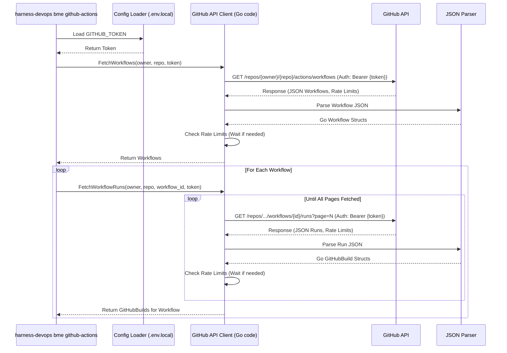

# Chapter 3: Platform Data Retrieval (Jenkins & GitHub)

Welcome back! In [Chapter 2: Configuration Handling](02_configuration_handling_.md), we learned how `harness-devops-cli` securely stores the information it needs, like your API tokens for Jenkins or GitHub. Think of it like getting your library card ready. Now, it's time to actually *use* that library card to check out some books – or in our case, fetch historical build data from those platforms!

This chapter explains how the tool retrieves build history data from external CI/CD platforms like Jenkins and GitHub Actions.

## What Problem Does Data Retrieval Solve?

To estimate future build times or costs, we first need to understand the past. How long did builds take previously? How often did they run? Were they successful?

Our tool can't magically know this information. It needs to ask the platforms (Jenkins or GitHub) where your builds actually happened. This process of asking for and receiving historical build data is what **Platform Data Retrieval** is all about.

Imagine you're a historian wanting to study ship voyages from the last century. You can't just guess how long each voyage took. You need to go to the archives (like Jenkins or GitHub), use your researcher ID (your API token), ask the librarian (the platform's API) for specific logbooks (build history), and then carefully read and organize the information you find.

Our tool acts like that historian, using the credentials you configured to:
1.  Connect to the platform's API.
2.  Ask for build history for your specific projects or repositories.
3.  Receive the data (usually in a format called JSON).
4.  Organize that data so it can be analyzed later.

## Key Concepts

Let's break down the librarian analogy further:

*   **APIs (Application Programming Interfaces):** Think of an API as the library's catalog or the librarian behind the counter. It's a set of rules and tools that allow different software programs (our CLI and Jenkins/GitHub) to talk to each other. We use the Jenkins API and the GitHub API.
*   **API Endpoints:** These are like specific sections in the library catalog or specific questions you can ask the librarian. For example, there's an endpoint to ask for "all workflows in this repository" or "all runs for that specific workflow". Each endpoint usually has a specific URL (web address).
*   **Authentication:** This is like showing your library card (API Token or Username/Password). Before Jenkins or GitHub give our tool any data (especially for private repositories), the tool needs to prove it has permission. It uses the credentials you saved in [Chapter 2: Configuration Handling](02_configuration_handling_.md).
*   **API Request:** This is the act of asking the question. Our tool constructs a specific request (like filling out a request slip) and sends it to the correct API endpoint URL. For fetching data, this is usually an HTTP `GET` request.
*   **JSON Response:** This is the information the librarian gives back. APIs usually send data back in a structured text format called **JSON** (JavaScript Object Notation). It looks a bit like nested lists and dictionaries.
*   **Parsing:** The raw JSON data isn't immediately useful to our Go program. Parsing is the process of reading the JSON text and converting it into organized Go data structures (structs) that our code can easily work with. We'll learn more about these structures in [Chapter 6: Build Data Models (Jenkins/GitHub)](06_build_data_models__jenkins_github__.md).
*   **Rate Limits (Especially GitHub):** Libraries sometimes limit how many books you can borrow at once or per day. Similarly, APIs (especially public ones like GitHub's) limit how many requests you can make in a certain time period to prevent abuse and ensure fair usage. Our tool needs to be aware of these limits (especially for GitHub) and pause if it gets close to exceeding them, just like waiting until tomorrow to borrow more books.

## How Does the Tool Use Data Retrieval?

You don't *directly* run a command just to fetch data. This data retrieval happens automatically as part of the forecast commands you learned about in [Chapter 1: CLI Command Framework](01_cli_command_framework_.md).

When you run:
`harness-devops bme github-actions --owner my-org --repo my-app`

Or:
`harness-devops bme jenkins`

One of the *first* things the tool does (after loading configuration) is to reach out to the specified platform (GitHub or Jenkins) using its API and retrieve the necessary build history.

**Example Flow:**

1.  **You run:** `harness-devops bme github-actions --owner my-org --repo my-app`
2.  **Tool Loads Config:** Reads `.env.local` to get `GITHUB_TOKEN`.
3.  **Tool Fetches Data (This Chapter!):**
    *   Connects to `api.github.com`.
    *   Uses the `GITHUB_TOKEN` to authenticate.
    *   Asks for workflows in `my-org/my-app` via an API request.
    *   Receives JSON data about workflows.
    *   Parses the JSON.
    *   For each workflow, asks for its recent runs via more API requests.
    *   Receives JSON data about runs (status, duration, time).
    *   Parses the JSON into internal `GitHubBuild` structures.
    *   Checks rate limits along the way and pauses if needed.
4.  **Tool Analyzes Data:** Uses the fetched build data (more in [Chapter 4: Build Data Analysis & Forecasting](04_build_data_analysis___forecasting_.md)).
5.  **Tool Generates Report:** Displays the results (more in [Chapter 5: Report Generation](05_report_generation_.md)).

So, while you don't type a specific "fetch" command, this data retrieval step is critical and happens behind the scenes.

## Under the Hood: Asking the APIs

Let's see how the tool interacts with the APIs step-by-step.

**Step-by-Step Walkthrough (GitHub Example):**

1.  **Initiate:** The `handleGitHubForecast` function (triggered by the `bme github-actions` command) starts.
2.  **Load Token:** It loads the `GITHUB_TOKEN` from the configuration ([Chapter 2: Configuration Handling](02_configuration_handling_.md)).
3.  **Identify Target:** It knows the owner (`my-org`) and repository (`my-app`) from the command flags.
4.  **Get Workflows:** It calls an internal function like `getGitHubWorkflows`.
    *   This function constructs the API URL: `https://api.github.com/repos/my-org/my-app/actions/workflows`.
    *   It creates an HTTP `GET` request to this URL.
    *   It adds an `Authorization` header with the `GITHUB_TOKEN` (showing the library card).
    *   It adds an `Accept` header specifying the desired API version.
    *   It sends the request using Go's standard `http.Client`.
5.  **Receive & Parse Workflows:**
    *   GitHub's API responds with JSON data listing the workflows.
    *   The tool reads this JSON response.
    *   It uses Go's `encoding/json` library to parse the JSON into a list of `GitHubWorkflow` structs.
6.  **Check Rate Limits:** After the response, it calls `checkRateLimits` to see how many requests are left. It calls `handleRateLimits` which might pause the program if the limit is low.
7.  **Get Runs for Each Workflow:** For each workflow found, it calls an internal function like `getGitHubWorkflowRuns`.
    *   This constructs another API URL, e.g., `https://api.github.com/repos/my-org/my-app/actions/workflows/12345/runs?per_page=100`. (It asks for 100 runs per page).
    *   It sends an authenticated request just like before.
8.  **Receive & Parse Runs:**
    *   GitHub responds with JSON data for the first 100 runs.
    *   The tool parses this into `GitHubRun` structs.
    *   It converts relevant fields (like start/end times) into a simplified `GitHubBuild` struct (defined in [Chapter 6: Build Data Models (Jenkins/GitHub)](06_build_data_models__jenkins_github__.md)).
9.  **Check Rate Limits:** Checks limits again.
10. **Handle Pagination:** If the response indicates there are more than 100 runs, the tool modifies the URL to ask for the *next* page (e.g., `...&page=2`) and repeats steps 7-9 until all runs are fetched.
11. **Data Ready:** The tool now has a list of `GitHubBuild` objects representing the historical data, ready for analysis.

**Sequence Diagram (GitHub Data Retrieval):**



**Diving into the Code:**

Let's look at simplified code snippets showing these steps.

1.  **Fetching GitHub Workflows (`cmd/github_forecast.go`)**

    ```go
    // Simplified function to get workflows
    func getGitHubWorkflows(owner, repo, token string) ([]GitHubWorkflow, error) {
    	// Construct the specific URL (API endpoint)
    	url := fmt.Sprintf("https://api.github.com/repos/%s/%s/actions/workflows", owner, repo)

    	// Create a new HTTP GET request
    	req, err := http.NewRequest("GET", url, nil)
    	// ... handle error ...

    	// Add the "library card" (Authentication token)
    	req.Header.Set("Authorization", "Bearer "+token)
    	// Specify the desired API format
    	req.Header.Set("Accept", "application/vnd.github.v3+json")

    	// Send the request using a standard HTTP client
    	client := &http.Client{}
    	resp, err := client.Do(req)
    	// ... handle error ...
    	defer resp.Body.Close()

    	// *** Check rate limits after getting response (see below) ***
    	rateLimit := checkRateLimits(resp)
    	handleRateLimits(rateLimit, "workflow fetching")

    	// ... check if response status is OK (e.g., 200) ...

    	// Prepare to parse the JSON response
    	var response GitHubAPIResponse // A struct to hold the parsed JSON
    	// Decode the JSON from the response body into the Go struct
    	err = json.NewDecoder(resp.Body).Decode(&response)
    	// ... handle error ...

    	// Return the list of workflows found
    	return response.Workflows, nil
    }
    ```
    This snippet shows building the URL, creating the request, adding headers (including Authentication), sending it, and parsing the JSON response using `json.NewDecoder`.

2.  **Handling GitHub Rate Limits (`cmd/github_forecast.go`)**

    ```go
    // Simplified function to check rate limits from response headers
    func checkRateLimits(resp *http.Response) *GitHubRateLimit {
    	// Read headers like "X-RateLimit-Remaining" and "X-RateLimit-Reset"
    	remaining, _ := strconv.Atoi(resp.Header.Get("X-RateLimit-Remaining"))
    	resetTimestamp, _ := strconv.ParseInt(resp.Header.Get("X-RateLimit-Reset"), 10, 64)
    	// ... get other limit headers ...

    	// Return a struct containing the rate limit info
    	return &GitHubRateLimit{
    		Remaining: remaining,
    		Reset:     time.Unix(resetTimestamp, 0), // Convert timestamp to Go time
    		// ... other fields ...
    	}
    }

    // Simplified function to potentially pause if rate limit is low
    func handleRateLimits(rateLimit *GitHubRateLimit, operationName string) {
    	if rateLimit == nil { return }

    	// If remaining requests are very low (e.g., <= 5)
    	if rateLimit.Remaining <= 5 {
    		// Calculate how long to wait until the limit resets
    		waitDuration := time.Until(rateLimit.Reset)
    		if waitDuration > 0 {
    			fmt.Printf("⏳ Rate limit low (%d left), pausing for %s...\n",
    				rateLimit.Remaining, waitDuration.Round(time.Second))
    			// Pause execution for the calculated duration + a small buffer
    			time.Sleep(waitDuration + 5*time.Second)
    			fmt.Println("✅ Resumed after rate limit reset.")
    		}
    	}
    }
    ```
    These functions extract rate limit info from the response headers (`checkRateLimits`) and pause the program (`time.Sleep`) if the number of remaining requests is too low (`handleRateLimits`).

3.  **Fetching Jenkins Builds (`cmd/jenkins_forecast.go`)**

    ```go
    // Simplified function to get builds for a Jenkins job
    func getBuilds(baseURL, jobName, user, token string) []Build {
    	// Construct the Jenkins API URL (different structure than GitHub)
    	url := fmt.Sprintf("%s/job/%s/api/json?tree=builds[number,result,duration,timestamp]", baseURL, jobName)

    	// Create the request
    	req, _ := http.NewRequest("GET", url, nil)

    	// Jenkins often uses Basic Authentication (Username + API Token)
    	req.SetBasicAuth(user, token)

    	// Send the request
    	client := &http.Client{}
    	resp, err := client.Do(req)
    	// ... handle errors & check response status ...
    	defer resp.Body.Close()

    	// Prepare a struct to hold the parsed JSON
    	var jobResponse struct {
    		Builds []Build `json:"builds"` // Expecting a list of 'Build' objects
    	}
    	// Parse the JSON response
    	json.NewDecoder(resp.Body).Decode(&jobResponse)

    	// Return the list of builds found
    	return jobResponse.Builds
    }
    ```
    This shows a similar process for Jenkins: construct URL, create request, set **Basic Authentication** header, send request, parse JSON into the `Build` struct (defined in [Chapter 6: Build Data Models (Jenkins/GitHub)](06_build_data_models__jenkins_github__.md)). Note that Jenkins typically doesn't have strict rate limits like the public GitHub API, so explicit rate limit handling is often omitted.

## Connecting to Other Concepts

*   **[Configuration Handling](02_configuration_handling_.md):** Provides the essential API tokens (the library card) needed for authentication during data retrieval.
*   **[Build Data Models (Jenkins/GitHub)](06_build_data_models__jenkins_github__.md):** Defines the Go `struct` formats (like `Build` and `GitHubBuild`) that the raw JSON data is parsed into.
*   **[Build Data Analysis & Forecasting](04_build_data_analysis___forecasting_.md):** This is the *next* step, which takes the lists of `Build` or `GitHubBuild` objects retrieved here and performs calculations on them.
*   **[CLI Command Framework](01_cli_command_framework_.md):** The `bme github-actions` and `bme jenkins` commands initiate the process that includes this data retrieval step.

## Conclusion

You've now seen how `harness-devops-cli` acts like a researcher, using the platform APIs (Jenkins or GitHub) as its archives. It uses the configured credentials for authentication (the library card), sends specific requests to API endpoints (asking the librarian for specific records), receives data in JSON format, and parses it into usable Go structures. For GitHub, it also respects API rate limits (borrowing limits). This crucial step gathers the raw historical data needed for understanding past performance.

But just having the raw data (the pile of logbooks) isn't enough. We need to analyze it to find patterns and calculate metrics.

**Next Up:** Let's explore how the tool analyzes this retrieved data to calculate statistics and make forecasts in [Chapter 4: Build Data Analysis & Forecasting](04_build_data_analysis___forecasting_.md).

---

Generated by [AI Codebase Knowledge Builder](https://github.com/The-Pocket/Tutorial-Codebase-Knowledge)