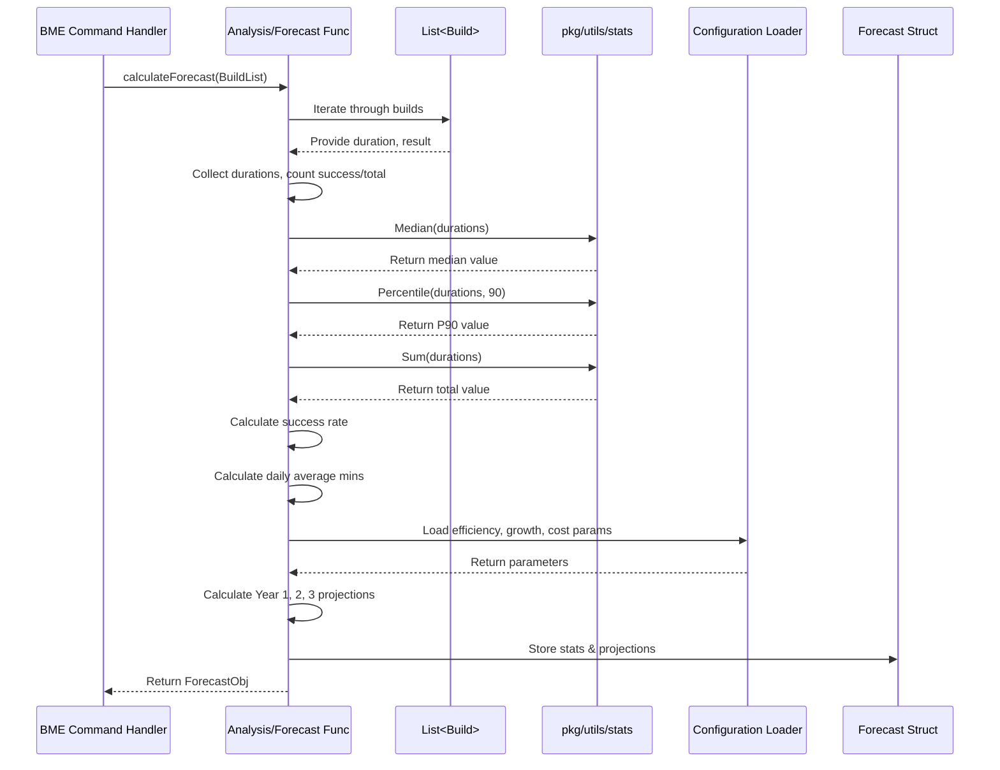

# Chapter 4: Build Data Analysis & Forecasting

In [Chapter 3: Platform Data Retrieval (Jenkins & GitHub)](03_platform_data_retrieval__jenkins___github__.md), we learned how `harness-devops-cli` acts like a historian, fetching raw build history data (like ship logbooks) from Jenkins or GitHub Actions. But just having a pile of logbooks isn't very useful on its own. You need to read them, understand them, find patterns, and maybe even predict future trends.

That's where **Build Data Analysis & Forecasting** comes in. Think of this step as a financial analyst reviewing your past bank statements (the raw build data). The analyst wouldn't just hand you back the pile of statements; they would calculate things like your average monthly spending, your biggest expenses, and how often you overspent (the statistics). Then, based on your past habits and maybe some goals you set (like "I want to save 10% more next year"), they would help you create a budget forecast for the future.

This chapter explains how our tool processes the retrieved build data to calculate meaningful statistics and then uses those statistics along with your configured settings to project future build usage and potential costs.

## What Problem Does Analysis & Forecasting Solve?

Raw build data, like a list of build start times, end times, and success/failure status, doesn't immediately tell you the important things:
*   How long do my builds *typically* take? (Not just the average, but also common cases and worst cases).
*   How reliable are my builds? (What percentage succeed?).
*   How busy is my build system? (How many builds run concurrently?).
*   Based on the past, how much build time might I use next year or the year after, especially if my team grows or we get more efficient?
*   What might that future usage cost on a platform like Harness CI?

Build Data Analysis & Forecasting answers these questions by turning raw data into insightful statistics and calculated projections.

## Key Concepts

Let's break down how the "financial analyst" works:

*   **Statistics Calculation:** This is about summarizing the past. The tool looks at the list of builds retrieved in the previous step and calculates key metrics:
    *   **Total Execution Time:** The sum of durations for all successful builds (how much time was spent *actually* building). Often measured in minutes.
    *   **Median (P50) Execution Time:** The "middle" build duration if you sorted all build times from fastest to slowest. This is often more representative than the average because it's less affected by a few unusually long or short builds. (If 101 builds ran, the median is the duration of the 51st build).
    *   **P90 Execution Time:** The 90th percentile duration. This means 90% of your builds finished *faster* than this time. It helps understand the upper end of common build times (a realistic "worst-case" scenario, ignoring extreme outliers).
    *   **Success Rate:** The percentage of builds that completed successfully. (e.g., `(Number of Successful Builds / Total Number of Builds) * 100`).
    *   **Concurrency Levels (Jenkins):** For Jenkins, it can estimate how many builds were running at the same time (median, P90).
*   **Utility Functions:** To calculate statistics like Median and P90 accurately, the tool uses helper functions. These live in the `pkg/utils` directory and handle the mathematical heavy lifting. Think of them as the analyst's calculator and spreadsheet formulas.
*   **Forecasting Parameters:** To predict the future, the analyst needs more than just past data; they need assumptions about what might change. These come from the settings you provided during configuration ([Chapter 2: Configuration Handling](02_configuration_handling_.md)):
    *   `HARNESS_EFFICIENCY_FACTOR`: How much faster (or slower) do you expect builds to be on Harness compared to your current platform? (e.g., `0.5` means 50% faster, `1.0` means the same speed).
    *   `YEARLY_GROWTH_RATE`: How much do you expect your build workload to increase each year? (e.g., `1.2` means a 20% increase per year).
    *   `COST_PER_MINUTE`: The estimated cost for each minute of build time on Harness CI.
    *   `CREDITS_FOR_CLOUD`: A multiplier representing Harness credits used per minute.
*   **Projection Logic:** This combines the historical statistics (like the average daily build minutes calculated from the past data) with the forecasting parameters. It does this year by year for typically 3 years:
    1.  Calculate the *current* average daily build minutes.
    2.  Estimate the *Year 1* build minutes on Harness (Current Daily Mins * Days in Year * Efficiency Factor).
    3.  Apply the growth rate for *Year 2* (Year 1 Mins * Growth Rate).
    4.  Apply the growth rate again for *Year 3* (Year 2 Mins * Growth Rate).
    5.  Calculate the estimated cost for each year (Yearly Mins * Cost Per Minute * Credits Multiplier).

## How to Use It: It Happens Automatically!

Similar to data retrieval, you don't run a separate command for analysis and forecasting. It's the next logical step that happens *inside* the `bme` (Build Minutes Estimate) commands after the data has been fetched.

When you run:
`harness-devops bme github-actions --owner my-org --repo my-app`

After the tool successfully retrieves the build history from GitHub ([Chapter 3: Platform Data Retrieval (Jenkins & GitHub)](03_platform_data_retrieval__jenkins___github__.md)), it *immediately* proceeds to:

1.  **Analyze:** Calculate the statistics (Total Time, Median, P90, Success Rate, etc.) from the retrieved builds.
2.  **Forecast:** Use these statistics and the parameters from your `.env.local` file ([Chapter 2: Configuration Handling](02_configuration_handling_.md)) to project the next 3 years of build minutes and costs.

The results of this analysis and forecasting are then formatted and displayed in the final step: [Chapter 5: Report Generation](05_report_generation_.md). You'll see tables summarizing the calculated statistics and the yearly projections.

## Under the Hood: Crunching the Numbers

Let's trace how the analysis and forecasting happen after the build data arrives.

**Step-by-Step Flow (High-Level):**

1.  **Input Received:** A function like `calculateGitHubForecast` or `calculateForecast` receives the list of `Build` or `GitHubBuild` objects ([Chapter 6: Build Data Models (Jenkins/GitHub)](06_build_data_models__jenkins_github__.md)) collected during data retrieval.
2.  **Initialize:** Create empty lists or maps to store things like durations of successful builds, counts of successes/failures, etc.
3.  **Iterate & Collect:** Loop through each `Build` object in the list:
    *   Check if the build was successful (`build.Result == "success"` or similar).
    *   If successful, add its duration (e.g., `build.Duration`) to a list of durations.
    *   Increment success/total counters.
    *   (Jenkins) Note the start/end times to calculate concurrency later.
    *   Collect statistics per specific job/workflow or runner type if needed.
4.  **Calculate Statistics:**
    *   Pass the collected list of durations to utility functions: `utils.Sum()`, `utils.Median()`, `utils.Percentile(..., 90)`.
    *   Calculate the success rate using the counters.
    *   (Jenkins) Analyze the concurrency data.
5.  **Calculate Historical Baseline:** Determine the total time span of the collected data (from the earliest build timestamp to the latest or today). Calculate the average build minutes used per day over this historical period.
6.  **Load Parameters:** Read `HARNESS_EFFICIENCY_FACTOR`, `YEARLY_GROWTH_RATE`, `COST_PER_MINUTE`, etc., from the environment (loaded from `.env.local` as seen in [Chapter 2: Configuration Handling](02_configuration_handling_.md)).
7.  **Project the Future:** Use the historical daily average and the loaded parameters to calculate the estimated build minutes and costs for Year 1, Year 2, and Year 3, applying the efficiency factor and growth rate sequentially.
8.  **Store Results:** Package all the calculated statistics and projections into a dedicated structure (like `GitHubForecast` or `Forecast`).
9.  **Output:** Return this forecast structure, ready to be passed to the reporting function.

**Sequence Diagram (Simplified):**



**Diving into the Code:**

Let's look at simplified snippets.

1.  **Iterating Builds & Collecting Durations (`cmd/github_forecast.go`)**
    This happens inside functions like `calculateGitHubForecast`.

    ```go
    // Simplified from calculateGitHubForecast
    func calculateGitHubForecast(workflows []GitHubWorkflow, jobsData map[string][]GitHubBuild) *GitHubForecast {
        // ... initialize maps/slices ...
        var allSuccessfulDurations []float64
        totalRuns := 0
        totalSuccess := 0

        // Loop through data for each workflow
        for workflowName, builds := range jobsData {
            var workflowDurations []float64
            // Loop through builds for *this* workflow
            for _, build := range builds {
                totalRuns++
                if build.Result == "success" || build.Conclusion == "success" { // Check success status
                    totalSuccess++
                    durationMinutes := float64(build.Duration) / 60000.0 // Convert ms to minutes
                    allSuccessfulDurations = append(allSuccessfulDurations, durationMinutes)
                    workflowDurations = append(workflowDurations, durationMinutes)
                }
                // ... collect other stats like per-runner ...
            }
            // ... calculate stats for this specific workflow using workflowDurations ...
        }
        // ... Now calculate overall stats using allSuccessfulDurations ...
        // ... (see next snippet) ...
        return stats // The final forecast object
    }
    ```
    This code loops through the build data, checks if a build was successful, converts its duration to minutes, and adds it to a list (`allSuccessfulDurations`) that will be used for overall statistics.

2.  **Using Utility Functions (`cmd/github_forecast.go`, `pkg/utils/stats.go`)**
    After collecting durations, calculate the statistics.

    ```go
    // Simplified from calculateGitHubForecast, continuing from above
    func calculateGitHubForecast(...) *GitHubForecast {
        // ... (previous loop finishes, allSuccessfulDurations is populated) ...

        stats := &GitHubForecast{ /* ... */ } // Initialize the forecast struct

        if len(allSuccessfulDurations) > 0 {
            sort.Float64s(allSuccessfulDurations) // Sort for median/percentile

            stats.ExecutionTime = GithubExecutionStats{
                Total:      utils.Sum(allSuccessfulDurations),
                Median:     utils.Median(allSuccessfulDurations), // Call utils.Median
                P90:        utils.Percentile(allSuccessfulDurations, 90), // Call utils.Percentile
                Min:        allSuccessfulDurations[0],
                Max:        allSuccessfulDurations[len(allSuccessfulDurations)-1],
                Executions: len(allSuccessfulDurations),
            }
        }
        // Calculate success rate (simplified)
        // stats.SuccessRate = (float64(totalSuccess) / float64(totalRuns)) * 100

        // ... calculate runner/workflow specific stats similarly ...
        return stats
    }

    // --- File: pkg/utils/stats.go ---
    package utils

    import "sort"

    // Median calculates the median of a slice of floats (requires sorting first)
    func Median(numbers []float64) float64 {
        // NOTE: Assumes 'numbers' is already sorted!
        n := len(numbers)
        if n == 0 { return 0 }
        middle := n / 2
        if n%2 == 1 {
            return numbers[middle] // Odd number of elements
        }
        // Even number of elements: average the middle two
        return (numbers[middle-1] + numbers[middle]) / 2.0
    }

    // Percentile calculates the nth percentile (requires sorting first)
    func Percentile(numbers []float64, percentile float64) float64 {
        // NOTE: Assumes 'numbers' is already sorted!
        n := len(numbers)
        if n == 0 { return 0 }
        // Simple percentile calculation: find the index
        index := int(float64(n) * percentile / 100.0)
        if index >= n { index = n - 1 } // Ensure index is within bounds
        return numbers[index]
    }

    // Sum calculates the sum of a slice of floats
    func Sum(numbers []float64) float64 {
        // ... (implementation as shown before) ...
        sum := 0.0
	    for _, num := range numbers { sum += num }
	    return sum
    }
    ```
    This shows how the collected durations (`allSuccessfulDurations`) are passed to helper functions like `utils.Median` and `utils.Percentile` (found in `pkg/utils/stats.go`) to compute the final statistics, which are then stored in the `stats` object. Remember to sort the data before calculating median and percentiles!

3.  **Calculating Projections (`cmd/github_forecast.go`)**
    This function takes the calculated historical stats and applies the configured parameters.

    ```go
    // Simplified from calculateProjections
    func calculateProjections(forecast *GitHubForecast, startDateStr string, harnessEfficiencyFactor float64, yearlyGrowthRate float64, costPerMinute float64, creditsForCloud float64) {

        // 1. Determine the time range of the historical data
        //    (Code to find earliest build timestamp or use --start-date)
        //    Calculate daysSinceStart = ...

        // 2. Calculate historical daily average
        totalHistoricalMins := forecast.ExecutionTime.Total // Get total mins from stats
        dailyAvgBuildMins := totalHistoricalMins / float64(daysSinceStart)
        if daysSinceStart < 1 { dailyAvgBuildMins = 0 } // Avoid division by zero

        // 3. Estimate Year 1 baseline on Harness
        //    (Assuming 5 working days * 52 weeks)
        currentPlatformYearlyMins := dailyAvgBuildMins * (5 * 52)
        harnessYear1Mins := currentPlatformYearlyMins * harnessEfficiencyFactor

        // 4. Project for 3 years using growth rate
        forecast.ProjectionsData = make([]ProjectionData, 0, 3)
        currentYearMins := harnessYear1Mins
        for i := 1; i <= 3; i++ {
            // Apply growth *after* the first year
            if i > 1 {
                 currentYearMins *= yearlyGrowthRate // Apply growth factor
            }
            yearlyCost := currentYearMins * costPerMinute * creditsForCloud
            forecast.ProjectionsData = append(forecast.ProjectionsData, ProjectionData{
                Year:            i,
                TotalBuildMins:  currentYearMins,
                TotalCreditCost: yearlyCost,
            })
        }
    }
    ```
    This code snippet calculates the historical daily average, applies the efficiency factor for the first year's estimate on Harness, and then iteratively applies the growth rate and cost parameters to project usage and cost for the next three years, storing the results in `forecast.ProjectionsData`.

## Connecting to Other Concepts

This analysis and forecasting step is tightly integrated with other parts:

*   **[Platform Data Retrieval (Jenkins & GitHub)](03_platform_data_retrieval__jenkins___github__.md):** Provides the essential raw input data (the list of `Build` or `GitHubBuild` objects).
*   **[Configuration Handling](02_configuration_handling_.md):** Supplies the crucial forecasting parameters (`HARNESS_EFFICIENCY_FACTOR`, `YEARLY_GROWTH_RATE`, `COST_PER_MINUTE`) needed for projections.
*   **[Build Data Models (Jenkins/GitHub)](06_build_data_models__jenkins_github__.md):** Defines the structure of the `Build` and `GitHubBuild` objects that are iterated over, and the `Forecast` / `GitHubForecast` structures that store the results.
*   **[Report Generation](05_report_generation_.md):** Takes the final `Forecast` object produced by this step and formats it into the human-readable tables you see in the terminal and saved files.

## Conclusion

You've now learned how `harness-devops-cli` transforms the raw build history fetched from Jenkins or GitHub into valuable insights. It calculates key statistics like median/P90 execution times and success rates, giving you a clear picture of past performance. Furthermore, using parameters you configured, it acts like a financial analyst, projecting future build minutes and potential costs on Harness CI based on historical trends, efficiency gains, and expected growth. This analysis and forecasting step is the bridge between raw data and actionable information.

The final step is to present all these calculated statistics and projections in a clear and understandable way.

**Next Up:** Let's see how the tool generates the final report tables you see on the screen in [Chapter 5: Report Generation](05_report_generation_.md).