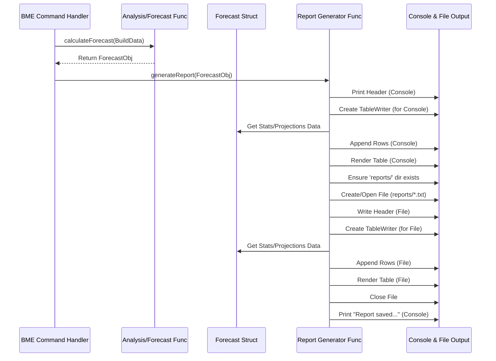

# Chapter 5: Report Generation

In [Chapter 4: Build Data Analysis & Forecasting](04_build_data_analysis___forecasting_.md), we saw how `harness-devops-cli` acts like an analyst, taking the raw build data and crunching the numbers to find statistics (like typical build times) and make projections about the future. But what good are all those calculations if you can't easily see or share them?

That's where **Report Generation** comes in. This is the final step where the tool takes all the calculated insights and presents them clearly to you.

Think of a journalist who has just finished a big investigation (like our analysis in Chapter 4). They have notebooks full of facts and figures. Report Generation is like that journalist doing two things:
1.  Writing a concise, well-structured news article for the front page (the neat tables you see in your **console**).
2.  Creating a detailed archive copy with all the findings for future reference (the **report file** saved in the `reports/` directory).

This chapter explains how `harness-devops-cli` displays the results of its analysis both on your screen and in a saved file.

## What Problem Does Report Generation Solve?

The main goal is **communication**. The raw results from the analysis step (like a bunch of numbers for median time, P90 time, success rate, yearly projections, etc.) need to be presented in a way that is:

1.  **Readable:** Easy for a human to quickly understand the key takeaways.
2.  **Organized:** Group related information together logically (e.g., summary stats, platform-specific details, future projections).
3.  **Persistent:** Saved somewhere so you can look back at it later or share it with others, without having to run the command again.

Without report generation, the tool might just dump a jumble of numbers, making it hard to interpret the findings.

## Key Concepts

*   **Console Output:** This is the information printed directly to your terminal screen when the command finishes. It's designed for quick viewing.
*   **`tablewriter` Library:** We use a special Go library called `olekukonko/tablewriter`. It's like a template tool that helps us draw neat text-based tables with borders and aligned columns, making the console output much easier to read.
*   **Report File:** In addition to the console output, the tool saves a more detailed report as a plain text file (`.txt`). This serves as a permanent record.
*   **`reports/` Directory:** All report files are saved inside a folder named `reports/` within the directory where you run the `harness-devops-cli` command. The tool creates this folder if it doesn't exist.
*   **Timestamped Filenames:** To avoid overwriting previous reports and to know *when* a report was generated, the filename includes the date and time (e.g., `github_forecast_20231027_1530.txt` or `jenkins_forecast_20231027_1531_1.txt` if run again in the same minute).

## How to Use It: It's Automatic!

Just like analysis and forecasting, report generation happens automatically at the end of the `bme` (Build Minutes Estimate) commands. You don't need to run a separate command to generate the report.

When you run a command like:
`harness-devops bme github-actions --owner my-org --repo my-app`

After the tool fetches the data ([Chapter 3: Platform Data Retrieval (Jenkins & GitHub)](03_platform_data_retrieval__jenkins___github__.md)) and analyzes it ([Chapter 4: Build Data Analysis & Forecasting](04_build_data_analysis___forecasting_.md)), the final step is to call the reporting functions.

**Example Output (Simplified Console):**

You'll see output in your terminal that looks something like this:

```text
📊 GitHub Actions Forecast Report

Repositories: 1
Total Workflows: 3
Total Runs: 542

📈 Runner Statistics:
+------------+------------------+-------------------+-----------------+------------------+
| TOTAL RUNS | TOTAL TIME (MIN) | MEDIAN TIME (MIN) | P90 TIME (MIN)  | SUCCESS RATE (%) |
+------------+------------------+-------------------+-----------------+------------------+
|        542 |          1234.56 |              2.10 |            5.50 |            95.30 |
+------------+------------------+-------------------+-----------------+------------------+

📋 Workflow Details:
+-------------------------+------------+------------------+------------------+-------------------+-----------------+
| WORKFLOW                | TOTAL RUNS | SUCCESS RATE (%) | TOTAL TIME (MIN) | MEDIAN TIME (MIN) | P90 TIME (MIN)  |
+-------------------------+------------+------------------+------------------+-------------------+-----------------+
| my-app: Build and Test  |        310 |            98.06 |           850.20 |              2.50 |            6.10 |
| my-app: Deploy Staging  |        115 |            90.43 |           210.11 |              1.80 |            4.20 |
| my-app: Deploy Prod     |        117 |            92.31 |           174.25 |              1.50 |            3.90 |
+-------------------------+------------+------------------+------------------+-------------------+-----------------+

📈 Projections
+--------+------------------+-------------------+
| YEAR   | TOTAL BUILD MINS | TOTAL CREDIT COST |
+--------+------------------+-------------------+
| Year 1 |          1500.00 |            180.00 |
| Year 2 |          1800.00 |            216.00 |
| Year 3 |          2160.00 |            259.20 |
+--------+------------------+-------------------+
✅ Report saved: reports/github_forecast_20231027_1530.txt
```

Simultaneously, a file named `github_forecast_20231027_1530.txt` (or similar) will be created in the `reports/` directory containing the same information.

## Under the Hood: Assembling the Report

Let's look at the steps the tool takes to generate these reports.

**Step-by-Step Flow:**

1.  **Receive Forecast Data:** A reporting function (like `generateGitHubReport` or `generateReport`) receives the completed `Forecast` or `GitHubForecast` object from the analysis step ([Chapter 4: Build Data Analysis & Forecasting](04_build_data_analysis___forecasting_.md)). This object contains all the calculated statistics and projections.
2.  **Prepare Console Output:**
    *   Print introductory text (e.g., "📊 GitHub Actions Forecast Report").
    *   Print summary statistics (Total Workflows, Total Runs).
    *   For each section (Runner Stats, Workflow Details, Projections):
        *   Create a `tablewriter` instance, telling it to write to `os.Stdout` (the console).
        *   Set the table headers (e.g., `[]string{"YEAR", "TOTAL BUILD MINS", ...}`).
        *   Loop through the relevant data in the forecast object (e.g., the `ProjectionsData` slice).
        *   For each item, format the data into strings and add it as a row to the table using `table.Append([]string{...})`.
        *   Call `table.Render()` to draw the table on the console.
3.  **Prepare File Output:**
    *   Ensure the `reports/` directory exists (create it if not).
    *   Construct the filename using the platform name and a timestamp (e.g., `github_forecast_YYYYMMDD_HHMM.txt`). Handle potential filename collisions by adding `_1`, `_2`, etc.
    *   Create and open the file for writing.
4.  **Write to File:**
    *   Write the same introductory text and summary stats to the file.
    *   For each section, create *another* `tablewriter` instance, but this time tell it to write to the *file handle* instead of `os.Stdout`.
    *   Set headers, loop through data, append rows, and call `Render()` just like for the console output. (This ensures the file has the same nice tables).
5.  **Close File:** Close the file handle to ensure all data is saved.
6.  **Confirm Save:** Print a confirmation message to the console indicating where the report file was saved.

**Sequence Diagram:**



**Diving into the Code:**

Let's look at simplified snippets.

1.  **Main Reporting Function (`cmd/github_forecast.go`)**
    This function orchestrates the report generation.

    ```go
    // Simplified from generateGitHubReport
    func generateGitHubReport(forecast *GitHubForecast) {
        fmt.Println("\n📊 GitHub Actions Forecast Report") // Header to console
        // ... print summary stats ...

        // --- Runner Statistics Table (Console) ---
        fmt.Println("\n\n📈 Runner Statistics:")
        runnerTableConsole := tablewriter.NewWriter(os.Stdout) // Target: Console
        runnerTableConsole.SetHeader([]string{"Total Runs", "Total Time (min)", ...})
        // Loop through forecast.RunnerStats
        for _, stats := range forecast.RunnerStats {
             runnerTableConsole.Append([]string{
                 fmt.Sprintf("%d", stats.TotalRuns), // Format numbers as strings
                 utils.FormatFloat(stats.TotalTime / 60000), // Use helper for floats
                 // ... more columns ...
             })
        }
        runnerTableConsole.Render() // Draw the table on console

        // --- Workflow Details Table (Console) ---
        // ... similar logic using tablewriter for workflows ...

        // --- Projections Table (Console) ---
        fmt.Println("\n📈 Projections")
        projectionsTableConsole := tablewriter.NewWriter(os.Stdout)
        projectionsTableConsole.SetHeader([]string{"YEAR", "TOTAL BUILD MINS", "TOTAL CREDIT COST"})
        // Loop through forecast.ProjectionsData
        for _, proj := range forecast.ProjectionsData {
            projectionsTableConsole.Append([]string{
                fmt.Sprintf("Year %d", proj.Year),
                utils.FormatFloat(proj.TotalBuildMins),
                utils.FormatFloat(proj.TotalCreditCost),
            })
        }
        projectionsTableConsole.Render()

        // --- Save the report to a file ---
        saveGitHubReport(forecast) // Call the file saving function
    }
    ```
    This shows how `fmt.Println` is used for simple text and `tablewriter.NewWriter(os.Stdout)` creates a table targeted at the console. `SetHeader`, `Append`, and `Render` are used to build and display the table. Finally, it calls a separate function `saveGitHubReport` to handle file saving.

2.  **Saving the Report to File (`cmd/github_forecast.go`)**
    This function handles creating the file and writing the report content to it.

    ```go
    // Simplified from saveGitHubReport
    func saveGitHubReport(forecast *GitHubForecast) {
        // 1. Ensure "reports" directory exists
        reportsDir := "reports"
        os.MkdirAll(reportsDir, 0755) // Creates the directory if needed

        // 2. Create a unique filename with timestamp
        timestamp := time.Now().Format("20060102_150405")
        filename := filepath.Join(reportsDir, fmt.Sprintf("github_forecast_%s.txt", timestamp))
        // ... (add logic here if needed to check if file exists and add _1, _2, etc.) ...

        // 3. Create the file
        file, err := os.Create(filename)
        if err != nil {
            log.Printf("❌ Error creating report file %s: %v", filename, err)
            return // Don't proceed if file creation fails
        }
        defer file.Close() // Ensure file is closed when function exits

        // 4. Write report content to the file (using tablewriter)
        file.WriteString("📊 GitHub Actions Forecast Report\n") // Header to file
        // ... write summary stats to file ...

        // Example: Write Projections Table to File
        file.WriteString("\n📈 Projections\n")
        projectionsTableFile := tablewriter.NewWriter(file) // Target: the file!
        projectionsTableFile.SetHeader([]string{"YEAR", "TOTAL BUILD MINS", "TOTAL CREDIT COST"})
        // Loop through forecast.ProjectionsData (same loop as before)
        for _, proj := range forecast.ProjectionsData {
            projectionsTableFile.Append([]string{ /* ... data ... */ })
        }
        projectionsTableFile.Render() // Draw the table *into the file*

        // ... write other tables (Runner, Workflow) to the file similarly ...

        // 5. Print confirmation to console
        fmt.Println("✅ Report saved:", filename)
    }
    ```
    This snippet shows creating the `reports/` directory, generating a timestamped filename, creating the file (`os.Create`), and then using `tablewriter.NewWriter(file)` to write the structured tables directly into the file. Finally, it prints the confirmation message to the console.

## Connecting to Other Concepts

*   **[Build Data Analysis & Forecasting](04_build_data_analysis___forecasting_.md):** This is the direct input provider. The `Forecast` object created in Chapter 4 is the data source for the reports.
*   **[CLI Command Framework](01_cli_command_framework_.md):** The `bme` commands defined in Chapter 1 are what trigger the entire process, culminating in this report generation step.
*   **Utility Functions (`pkg/utils`):** Helper functions like `utils.FormatFloat` are used to make the numbers in the report look clean (e.g., limiting decimal places).

## Conclusion

You've now seen the final step in the `harness-devops-cli` workflow: Report Generation. Like a journalist publishing their findings, the tool takes the results of its analysis and presents them in easy-to-read tables on your console using the `tablewriter` library. It also saves a permanent, timestamped copy of this report in the `reports/` directory for your records. This ensures that the valuable insights gained from analyzing your build data are clearly communicated and preserved.

Throughout these chapters, we've mentioned data structures like `Build`, `GitHubBuild`, and `Forecast` that are passed between these different stages. How are these actually defined?

**Next Up:** Let's look at the blueprints for organizing the build data within the tool in [Chapter 6: Build Data Models (Jenkins/GitHub)](06_build_data_models__jenkins_github__.md).