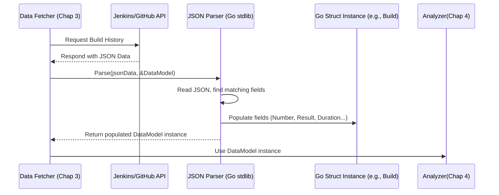

# Chapter 6: Build Data Models (Jenkins/GitHub)

Welcome to the final chapter! In [Chapter 5: Report Generation](05_report_generation_.md), we saw how the tool presents the calculated statistics and forecasts in neat tables. But how does the tool keep track of all that build information *before* it gets analyzed and reported? Where does it store the data it fetches from Jenkins or GitHub?

That's where **Build Data Models** come in. Think of them as the standardized forms the tool uses internally to organize the information received from different platforms.

## What Problem Do Data Models Solve?

When our tool asks Jenkins or GitHub for build history ([Chapter 3: Platform Data Retrieval (Jenkins & GitHub)](03_platform_data_retrieval__jenkins___github__.md)), each platform sends back data in its own specific format (usually JSON). Jenkins might call a build's success status `"SUCCESS"`, while GitHub might call it `"success"` or `"completed"` with a `"conclusion"` field. The duration might be in milliseconds in one API and seconds in another.

This inconsistency makes it hard to write code that works for both platforms. We need a way to translate the information from each platform's unique format into a common, predictable structure that the rest of our Go code can easily understand and work with.

**Build Data Models** are these common structures. They act like standardized application forms: no matter how you gathered the information (phone call, website, paper form), you fill it into the same application form with the same fields (Name, Address, Date of Birth). Our tool uses these models to store key details like build number, result, duration, and when it ran, regardless of whether the data came from Jenkins or GitHub.

## Key Concepts

*   **Go Structs (`struct`):** In the Go programming language, a `struct` (short for structure) is like a blueprint for creating a custom data container. You define the "fields" the container should have, like defining the boxes on a form. Once you have the blueprint, you can create instances of that container and fill in the fields with actual data.
*   **Standardized Fields:** Our data models define specific fields for the essential pieces of build information we care about:
    *   A build identifier (like a number or ID).
    *   The outcome (e.g., "success", "failure").
    *   How long it took (duration).
    *   When it happened (timestamp).
    *   Maybe which workflow or job it belonged to.
*   **Jenkins Model (`Build`):** Found in the `cmd/jenkins_forecast.go` file, the `Build` struct is designed to hold the standardized information extracted from the Jenkins API responses.
*   **GitHub Models (`GitHubRun`, `GitHubBuild`):** Found in the `cmd/github_forecast.go` file, the `GitHubRun` struct might hold the raw data closer to the GitHub API's format, while the `GitHubBuild` struct holds the simplified, standardized version used for analysis, similar to the Jenkins `Build` struct.

Using these models makes the code for [Build Data Analysis & Forecasting](04_build_data_analysis___forecasting_.md) much simpler, as it can expect the data to always be in the same format, regardless of the source platform.

## How Are They Used?

You, as a user of the CLI tool, don't directly interact with these Go structs. They are used internally by the code:

1.  **During Data Retrieval ([Chapter 3: Platform Data Retrieval (Jenkins & GitHub)](03_platform_data_retrieval__jenkins___github__.md)):** After fetching the raw JSON data from the Jenkins or GitHub API, the code *parses* this JSON and *populates* instances of these structs. It's like taking the raw interview notes (JSON) and filling out the standard application form (the struct instance).
2.  **During Analysis & Forecasting ([Chapter 4: Build Data Analysis & Forecasting](04_build_data_analysis___forecasting_.md)):** The analysis functions receive lists of these populated struct instances. They read the standardized fields (like `Duration`, `Result`, `Timestamp`) from each struct to perform calculations (median time, success rate, projections).
3.  **During Report Generation ([Chapter 5: Report Generation](05_report_generation_.md)):** The reporting functions also read data from the final forecast structs (which themselves contain aggregated data derived from the build models) to display the results in tables.

Essentially, these structs act as containers carrying the standardized build information through the different processing stages within the tool.

## Under the Hood: From JSON to Structs

Let's peek at how the raw data becomes structured data.

**Step-by-Step Flow (Simplified):**

1.  **API Request Sent:** The tool asks Jenkins or GitHub for build data ([Chapter 3: Platform Data Retrieval (Jenkins & GitHub)](03_platform_data_retrieval__jenkins___github__.md)).
2.  **JSON Response Received:** The platform's API sends back data in JSON format. This might look like a complex text structure with nested information.
3.  **Define the Blueprint:** The Go code has the `struct` definitions (like `Build` or `GitHubBuild`) ready – these are the empty forms.
4.  **Parse and Populate:** The code uses Go's built-in JSON parsing capabilities (`encoding/json` package). It tells the parser: "Read this incoming JSON data and try to fill in the fields of this struct based on matching names or special tags."
5.  **Structured Data Ready:** The result is a Go variable (or a list of variables) of the struct type, with the relevant data neatly organized in its fields, ready for the next step (analysis).

**Sequence Diagram (Parsing JSON into Struct):**



**Diving into the Code:**

Let's look at the simplified blueprints (struct definitions).

1.  **Jenkins Build Model (`cmd/jenkins_forecast.go`)**

    ```go
    // File: cmd/jenkins_forecast.go (Simplified Struct Definition)

    // Build represents a single Jenkins build with standardized fields.
    // The `json:"..."` tags tell the JSON parser which JSON key maps to which struct field.
    type Build struct {
        Number    int    `json:"number"`      // Jenkins build number
        Result    string `json:"result"`      // e.g., "SUCCESS", "FAILURE"
        Duration  int64  `json:"duration"`    // Build duration in milliseconds
        Timestamp int64  `json:"timestamp"`   // Build start time (Unix timestamp, ms)
    }
    ```
    This defines the `Build` struct. It's like creating a form with four boxes: `Number` (expects a whole number), `Result` (expects text), `Duration` (expects a large whole number for milliseconds), and `Timestamp` (expects another large whole number). The `json:"..."` parts are instructions for the parser.

2.  **GitHub Build Model (`cmd/github_forecast.go`)**

    ```go
    // File: cmd/github_forecast.go (Simplified Struct Definition)

    // GitHubBuild represents a GitHub Actions workflow run with normalized fields,
    // making it similar to the Jenkins 'Build' struct for consistent processing.
    type GitHubBuild struct {
        Number       int    // Corresponds to GitHub's 'run_number'
        Result       string // Derived from 'conclusion' (e.g., "success", "failure")
        Duration     int64  // Calculated duration in milliseconds
        Timestamp    int64  // Start time (Unix timestamp, ms) derived from 'created_at'
        WorkflowName string // Name of the workflow
        RunnerName   string // Type of runner used (e.g., "GitHub Actions")
    }
    // Note: This struct might not have `json` tags if it's populated manually
    // after parsing a more complex raw GitHub API response struct (like GitHubRun).
    ```
    This defines the `GitHubBuild` struct. It holds similar information to the Jenkins `Build` (Number, Result, Duration, Timestamp) but adds GitHub-specific context like `WorkflowName` and `RunnerName`. This struct might be filled in by processing data from a more detailed struct that directly matches the GitHub API's JSON response.

3.  **Populating the Struct (Conceptual)**
    In [Chapter 3: Platform Data Retrieval (Jenkins & GitHub)](03_platform_data_retrieval__jenkins___github__.md), you saw code using `json.NewDecoder(resp.Body).Decode(&jobResponse)` or similar. Let's simplify that concept:

    ```go
    // Conceptual example - not exact code from the project

    // Imagine 'jsonDataBytes' holds the JSON received from the API:
    // {"number": 123, "result": "SUCCESS", "duration": 35000, "timestamp": 1678886400000}
    var jsonDataBytes []byte = ... // Get JSON data from API response

    // Create an empty container based on the Build blueprint
    var jenkinsBuild Build

    // Tell the parser to fill the container using the JSON data
    err := json.Unmarshal(jsonDataBytes, &jenkinsBuild)
    if err != nil {
        // Handle error if JSON doesn't match the struct
    }

    // Now, 'jenkinsBuild' is populated:
    // jenkinsBuild.Number == 123
    // jenkinsBuild.Result == "SUCCESS"
    // jenkinsBuild.Duration == 35000
    // jenkinsBuild.Timestamp == 1678886400000
    ```
    This conceptual code shows how `json.Unmarshal` takes the raw JSON bytes and the address of an empty `Build` struct (`&jenkinsBuild`) and fills the struct's fields based on the JSON content.

## Connecting to Other Concepts

These data models are central to how information flows within the tool:

*   **[Platform Data Retrieval (Jenkins & GitHub)](03_platform_data_retrieval__jenkins___github__.md):** This step is responsible for *creating* and *populating* instances of these data models (`Build`, `GitHubBuild`) by parsing the incoming JSON from the APIs.
*   **[Build Data Analysis & Forecasting](04_build_data_analysis___forecasting__.md):** This step *consumes* lists of these data models. It reads the standardized fields (`Duration`, `Result`, etc.) from each instance to calculate statistics and make projections. The results are often stored in aggregate forecast structs (like `Forecast` or `GitHubForecast`).
*   **[Report Generation](05_report_generation_.md):** This step reads the aggregated data from the forecast structs (which were derived from the build models) to display the final report tables.

## Conclusion

Congratulations on completing the `harness-devops-cli` tutorial!

In this final chapter, you learned about the **Build Data Models** – the Go `structs` like `Build` and `GitHubBuild`. You discovered that they act as essential internal blueprints or standardized forms, allowing the tool to organize data fetched from different platforms (Jenkins, GitHub) into a consistent format. These models ensure that the data parsing step ([Chapter 3](03_platform_data_retrieval__jenkins___github__.md)) produces predictable output for the analysis step ([Chapter 4](04_build_data_analysis___forecasting_.md)) and subsequent reporting ([Chapter 5](05_report_generation_.md)). They are the glue that holds the data flow together within the application.

Throughout this tutorial, you've journeyed from understanding the command structure ([Chapter 1](01_cli_command_framework_.md)) and configuration ([Chapter 2](02_configuration_handling_.md)), through fetching ([Chapter 3](03_platform_data_retrieval__jenkins___github__.md)) and analyzing ([Chapter 4](04_build_data_analysis___forecasting_.md)) data, to generating reports ([Chapter 5](05_report_generation_.md)) and understanding the data's internal representation ([Chapter 6](06_build_data_models__jenkins_github__.md)). We hope this gives you a solid foundation for understanding, using, and perhaps even contributing to the `harness-devops-cli` project!

---

Generated by [AI Codebase Knowledge Builder](https://github.com/The-Pocket/Tutorial-Codebase-Knowledge)