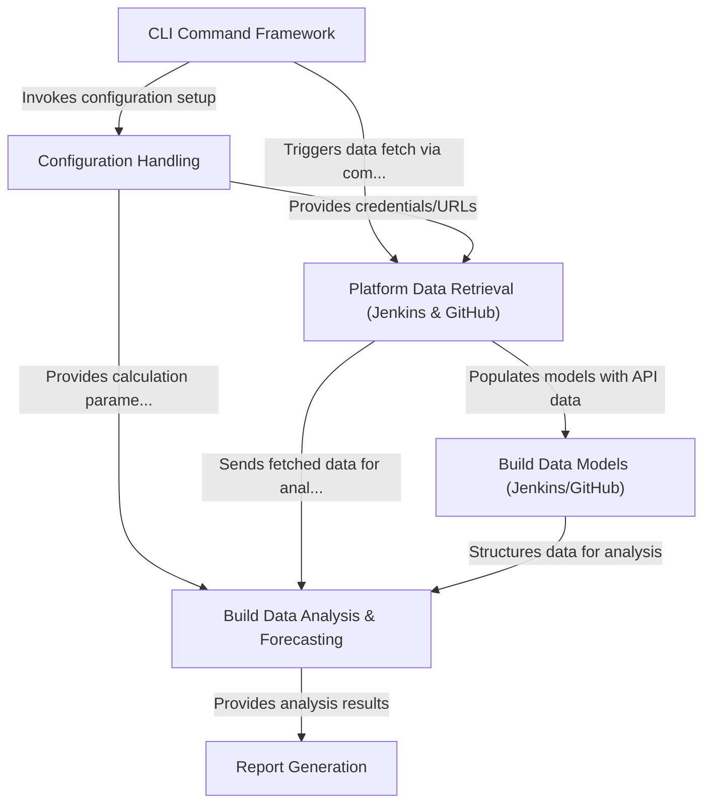

# Tutorial: harness-devops-cli

This project is a **command-line tool** designed to help estimate *future build usage* on the Harness CI platform.
It works by fetching historical build data from your existing CI/CD systems (**Jenkins** or **GitHub Actions**), analyzing this data to understand current usage patterns (like build times and frequency), and then generating a forecast based on configurable parameters like *expected growth*.
The results are displayed in the console and saved to a report file.

**Source Repository:** [None](None)

## Chapters

1. [CLI Command Framework
](01_cli_command_framework_.md)
2. [Configuration Handling
](02_configuration_handling_.md)
3. [Platform Data Retrieval (Jenkins & GitHub)
](03_platform_data_retrieval__jenkins___github__.md)
4. [Build Data Analysis & Forecasting
](04_build_data_analysis___forecasting_.md)
5. [Report Generation
](05_report_generation_.md)
6. [Build Data Models (Jenkins/GitHub)
](06_build_data_models__jenkins_github__.md)

---

Generated by [AI Codebase Knowledge Builder](https://github.com/The-Pocket/Tutorial-Codebase-Knowledge)