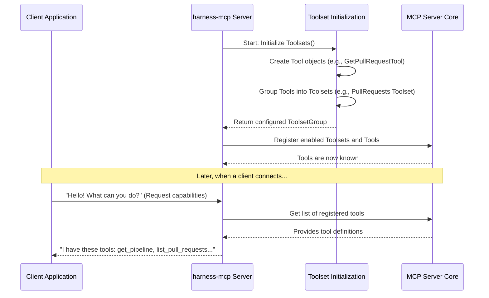

# Chapter 1: Tools & Toolsets

Welcome to your first step in understanding the `harness-mcp` project! This server is designed to let other programs (like AI assistants or automation scripts) interact with Harness features. But how do these programs know what actions they can ask our server to do? That's where "Tools" and "Toolsets" come in.

## What's the Big Idea?

Imagine you have a fantastic workshop filled with all sorts of useful tools: screwdrivers, hammers, wrenches, and power drills.
*   Each **tool** (like a specific screwdriver) performs a distinct, single job (e.g., "tighten a Phillips head screw").
*   You'd probably organize these tools into **toolboxes** (or toolsets) based on what they do. For example, all your screwdrivers might go into one toolbox, and all your wrenches into another.

In `harness-mcp`, it's very similar:
*   **Tools** are specific actions the server can perform. For example, "get details for a specific pipeline" is a tool, or "list all recent pull requests" is another tool.
*   **Toolsets** are collections of related tools. For example, a "Pipelines Toolset" would contain all tools related to managing and viewing pipelines, while a "Pull Requests Toolset" would group tools for pull request operations.

This organization makes it easy for other programs (we'll call them "clients") to:
1.  Discover what kinds of actions the `harness-mcp` server can do (by looking at the available toolsets).
2.  Understand the specific operations they can request (by looking at the tools within a toolset).

The `harness-mcp` server "registers" these tools and toolsets, essentially putting them on display so clients know what's available.

## Tools: The Individual Workers

A **Tool** represents a single, callable action the server can execute. Think of it as a command you can give the server. Each tool has:
*   A **name**: A unique identifier, like `get_pipeline` or `list_pull_requests`.
*   A **description**: A human-readable explanation of what the tool does.
*   **Parameters**: The information the tool needs to do its job. For example, the `get_pipeline` tool would need a `pipeline_id` parameter to know *which* pipeline's details to fetch.

Let's look at some examples from the `harness-mcp` server (you can also see these in the project's `README.md`):

From the **Pipelines Toolset**:
*   `get_pipeline`: Get details of a specific pipeline.
    *   *Parameter example*: `pipeline_id: "my_awesome_pipeline"`
*   `list_pipelines`: List pipelines in a repository.

From the **Pull Requests Toolset**:
*   `get_pull_request`: Get details of a specific pull request.
    *   *Parameter example*: `repo_id: "my_app_repo"`, `pr_number: 123`
*   `create_pull_request`: Create a new pull request.
    *   *Parameter examples*: `repo_id: "my_app_repo"`, `title: "New Feature"`, `source_branch: "feature/abc"`, `target_branch: "main"`

When a client wants to use a tool, it sends a request to the server specifying the tool's name and providing the necessary parameters. The server then executes the action and sends back a result.

## Toolsets: The Organized Toolboxes

A **Toolset** is simply a way to group related tools. This helps organize the server's capabilities and makes them easier for clients to understand and navigate.

For instance, `harness-mcp` has these toolsets:
*   **Pipelines Toolset**: Contains tools like `get_pipeline`, `list_pipelines`, `get_execution`, etc. All related to Harness pipelines.
*   **Pull Requests Toolset**: Contains tools like `get_pull_request`, `list_pull_requests`, `create_pull_request`, etc. All related to pull requests.
*   **Repositories Toolset**: For repository-related actions.
*   **Logs Toolset**: For log-related actions.

When a client connects, it can ask, "What toolsets do you have?" The server can then reply with "Pipelines, Pull Requests, Repositories, and Logs." The client can then explore the tools within each toolset.

## How Tools and Toolsets are Defined

Let's peek at how a tool might be defined in the Go code for `harness-mcp`. Don't worry about understanding every detail; just get a feel for the structure.

Here's a simplified look at how the `get_pull_request` tool is defined (from `pkg/harness/pullreq.go`):

```go
// Simplified from pkg/harness/pullreq.go
// ... other imports ...
import (
	"github.com/mark3labs/mcp-go/mcp" // MCP library for defining tools
	// ... other harness-mcp imports ...
)

func GetPullRequestTool(config *config.Config, client *client.Client) (mcp.Tool, server.ToolHandlerFunc) {
	return mcp.NewTool("get_pull_request", // The tool's name
			mcp.WithDescription("Get details of a specific pull request..."), // Its description
			mcp.WithString("repo_id", // Define a string parameter named "repo_id"
				mcp.Required(),        // This parameter is mandatory
				mcp.Description("The ID of the repository"),
			),
			mcp.WithNumber("pr_number", // Define a number parameter "pr_number"
				mcp.Required(),
				mcp.Description("The number of the pull request"),
			),
			// ... other options ...
		),
		// This part (the handler) is the actual code that runs when the tool is called.
		// We'll cover handlers more in later chapters.
		func(ctx context.Context, request mcp.CallToolRequest) (*mcp.CallToolResult, error) {
			// ... code to fetch PR details using repo_id and pr_number ...
			// ... and return the result ...
			return mcp.NewToolResultText("Details of PR"), nil // Simplified result
		}
}
```
In this snippet:
*   `mcp.NewTool(...)` is used to create a new tool.
*   It's given a name (`"get_pull_request"`) and a `Description`.
*   Parameters like `"repo_id"` (a string) and `"pr_number"` (a number) are defined, along with whether they are `Required`.

And here's how these tools are grouped into toolsets (simplified from `pkg/harness/tools.go`):

```go
// Simplified from pkg/harness/tools.go
// ... imports ...
import (
	"github.com/harness/harness-mcp/pkg/toolsets" // Our toolset management code
	// ... other harness-mcp imports ...
)

func InitToolsets(client *client.Client, config *config.Config) (*toolsets.ToolsetGroup, error) {
	tsg := toolsets.NewToolsetGroup(config.ReadOnly) // Create a group for all toolsets

	// Create the pull requests toolset
	pullrequests := toolsets.NewToolset("pullrequests", "Harness Pull Request related tools").
		AddReadTools( // Add tools that mainly read data
			toolsets.NewServerTool(GetPullRequestTool(config, client)),    // Our tool from above
			toolsets.NewServerTool(ListPullRequestsTool(config, client)),
			// ... other read-only PR tools ...
		).
		AddWriteTools( // Add tools that can change data (like creating a PR)
			toolsets.NewServerTool(CreatePullRequestTool(config, client)),
		)

	// Create the pipelines toolset (similar structure)
	pipelines := toolsets.NewToolset("pipelines", "Harness Pipeline related tools").
		AddReadTools(
            // ... pipeline tools like GetPipelineTool, ListPipelinesTool ...
        )
	
	tsg.AddToolset(pullrequests) // Add the Pull Requests toolset to the group
	tsg.AddToolset(pipelines)   // Add the Pipelines toolset to the group
	// ... add other toolsets like Repositories, Logs ...

	// Enable requested toolsets (e.g., based on configuration)
	if err := tsg.EnableToolsets(config.Toolsets); err != nil {
		return nil, err
	}
	return tsg, nil
}
```
Here:
*   `toolsets.NewToolset(...)` creates a toolbox, giving it a name (e.g., `"pullrequests"`) and description.
*   `AddReadTools(...)` and `AddWriteTools(...)` are used to put individual tools (like `GetPullRequestTool`) into this toolbox.
*   `tsg.AddToolset(...)` adds these filled toolboxes to an overall group.

This setup prepares all the tools and toolsets, ready for the [MCP Server Core](02_mcp_server_core_.md) to make them available to clients.

## Under the Hood: How it Works

When the `harness-mcp` server starts up, a few things happen to make these tools and toolsets operational:

1.  **Initialization**: The `InitToolsets` function (shown above) is called. It creates all the defined `Tool` and `Toolset` objects.
2.  **Configuration**: The server checks its configuration (e.g., environment variables or command-line arguments like `HARNESS_TOOLSETS` or `--toolsets`) to see which toolsets should be enabled. For example, you might only want to enable the "Pipelines" and "Repositories" toolsets.
3.  **Registration**: The enabled toolsets, along with their tools, are "registered" with the [MCP Server Core](02_mcp_server_core_.md). This means the server's central engine now knows about these specific actions it can perform and how to execute them.
4.  **Discovery by Clients**: When an MCP client (like an AI assistant) connects to the `harness-mcp` server, it can ask the server for a list of its capabilities. The server, using the information from the registered tools and toolsets, will provide a structured list of available tools, their descriptions, and the parameters they expect.

Here's a simplified flow:



The `pkg/toolsets/toolsets.go` file contains the general logic for managing toolsets:

*   `NewToolset(name, description)`: Creates a new, empty toolset.
    ```go
    // Simplified from pkg/toolsets/toolsets.go
    func NewToolset(name string, description string) *Toolset {
        return &Toolset{ // A Toolset is a struct holding its info
            Name:        name,
            Description: description,
            Enabled:     false, // Disabled by default
            // ... other fields ...
        }
    }
    ```
*   `AddReadTools(...)` / `AddWriteTools(...)`: Adds tools to a toolset.
    ```go
    // Simplified from pkg/toolsets/toolsets.go
    func (t *Toolset) AddReadTools(tools ...server.ServerTool) *Toolset {
        t.readTools = append(t.readTools, tools...) // Appends to a list of read tools
        return t
    }
    ```
*   `ToolsetGroup`: Manages a collection of different toolsets.
    *   `AddToolset(ts *Toolset)`: Adds a toolset to the group.
    *   `EnableToolsets(names []string)`: Marks specified toolsets (or "all") as active.
    *   `RegisterTools(s *server.MCPServer)`: Iterates through enabled toolsets and tells the [MCP Server Core](02_mcp_server_core_.md) about each tool.
        ```go
        // Simplified from pkg/toolsets/toolsets.go
        func (tg *ToolsetGroup) RegisterTools(s *server.MCPServer) {
            for _, toolset := range tg.Toolsets { // Loop through all toolsets in the group
                if toolset.Enabled { // Only if this toolset is enabled
                    // Register read-only tools
                    for _, tool := range toolset.readTools {
                        s.AddTool(tool.Tool, tool.Handler) // Tell the server about this tool
                    }
                    // If not in read-only mode, register write tools too
                    if !toolset.readOnly {
                        for _, tool := range toolset.writeTools {
                            s.AddTool(tool.Tool, tool.Handler)
                        }
                    }
                }
            }
        }
        ```
        The `s.AddTool(...)` call is crucial. It's how the main server (represented by `s` of type `*server.MCPServer`) learns about each individual tool and the function (handler) that executes it.

## Conclusion

You've now learned about the fundamental building blocks of `harness-mcp`'s capabilities: **Tools** and **Toolsets**.
*   **Tools** are the specific, invokable actions the server can perform (like `get_pipeline_details`).
*   **Toolsets** are collections of related tools (like a "Pipelines Toolset").

This system allows `harness-mcp` to clearly define and organize its functionalities, making them discoverable and usable by client applications. It's like having a well-organized workshop where every tool is labeled and placed in the correct toolbox, ready for use!

Now that you understand *what* actions the server can perform, you might be wondering about the "engine" that powers it all and manages communication with clients. That's exactly what we'll explore in the next chapter!

Next up: [Chapter 2: MCP Server Core](02_mcp_server_core_.md)