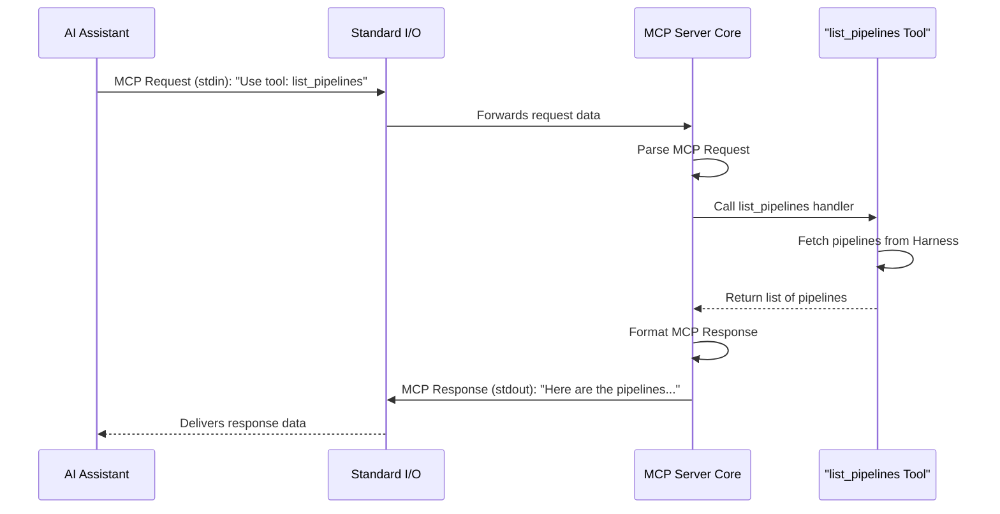

# Chapter 2: MCP Server Core

In [Chapter 1: Tools & Toolsets](01_tools___toolsets_.md), we learned about the specific actions (`Tools`) `harness-mcp` can perform and how they are organized into `Toolsets`. But how does an external application, like an AI assistant, actually tell our server to perform one of these actions? And how does our server understand these requests and make sure the right tool gets the job done?

This is where the **MCP Server Core** comes into play. It's the heart and brain of the `harness-mcp` application.

## The Central Operator: What is the MCP Server Core?

Imagine a busy call center. This call center has many departments (our `Tools` from Chapter 1), each specialized in a certain task (like "listing pipelines" or "getting pull request details"). The **MCP Server Core** is like the main operator at this call center.

This operator is highly specialized:
1.  **Speaks a Unique Language**: It understands a specific protocol called the **Model Context Protocol (MCP)**. This is the language that clients (like AI assistants) must use to make requests.
2.  **Listens for Calls**: It constantly listens for incoming requests. In `harness-mcp`, these requests typically arrive via **stdio** (standard input/output), which is a common way for programs to communicate by sending text back and forth.
3.  **Interprets Requests**: When a request arrives in the MCP language, the Server Core deciphers it. It figures out which "department" (Tool) the client wants to talk to and what information (parameters) the client is providing.
4.  **Routes Calls**: It then "routes the call" by invoking the appropriate Tool with the given parameters.
5.  **Delivers Results**: Once the Tool finishes its job and provides a result, the Server Core takes that result, formats it back into the MCP language, and sends it back to the client.

So, the MCP Server Core is the central nervous system. It doesn't do the specific tasks itself (the Tools do that), but it manages all communication and ensures that requests are understood and directed correctly.

## How Does It Work? A Day in the Life of the Server Core

Let's say an AI assistant (the "client") wants to get a list of all pipelines in your Harness project. Here's a simplified step-by-step of what happens, involving the MCP Server Core:

1.  **Client Sends a Request**: The AI assistant crafts a message in the MCP format. This message essentially says, "I want to use the tool named `list_pipelines`." This message is sent to the `harness-mcp` server over stdio (specifically, to its standard input).

2.  **Server Core Listens**: The MCP Server Core in `harness-mcp` is always listening on standard input for such messages.

3.  **Server Core Receives and Parses**: The Core receives the raw message. It understands MCP, so it parses the message and identifies:
    *   The requested tool: `list_pipelines`.
    *   Any parameters provided (for `list_pipelines`, there might not be any required ones, or perhaps optional ones like a repository ID).

4.  **Server Core Finds the Tool**: The Core checks its list of registered tools (remember how tools were registered in [Chapter 1: Tools & Toolsets](01_tools___toolsets_.md)?). It finds the `list_pipelines` tool and the actual Go function associated with it (the "handler").

5.  **Server Core Calls the Tool Handler**: The Core executes the `list_pipelines` tool's handler function, passing along any parameters from the client's request.

6.  **Tool Does Its Work**: The `list_pipelines` tool handler runs. It might internally use the [Harness API Client](05_harness_api_client_.md) to fetch the pipeline data from your Harness account.

7.  **Tool Returns a Result**: The tool handler finishes and returns the list of pipelines (or an error if something went wrong) back to the MCP Server Core.

8.  **Server Core Formats the Response**: The Core takes this result, packages it into a proper MCP response message.

9.  **Server Core Sends the Response**: The Core sends this MCP response message back to the AI assistant over stdio (specifically, via its standard output).

10. **Client Receives Result**: The AI assistant receives the MCP response, parses it, and now has the list of pipelines!

Here's a diagram illustrating this flow:



The MCP Server Core is the central piece orchestrating this entire interaction. You don't usually interact with the Core's code directly when adding new tools; instead, you rely on it to make your tools accessible.

## Under the Hood: Setting Up the Server Core

When you run the `harness-mcp-server` application, part of its startup process involves creating and configuring this MCP Server Core. Let's peek at how this is done in the code.

The main setup happens in `cmd/harness-mcp-server/main.go`, specifically within a function that might be called `runStdioServer` (or similar) when you start the server with the `stdio` command.

```go
// Simplified from cmd/harness-mcp-server/main.go

// ... other imports ...
import (
	"github.com/harness/harness-mcp/pkg/harness"      // Our project's harness-specific code
	"github.com/mark3labs/mcp-go/server"            // The generic MCP server library
	// ... other imports ...
)

func runStdioServer(appConfig someAppConfigType) error {
	// ... context and logger setup ...

	// 1. Create the MCP Server Core instance
	// 'harness.NewServer' is a helper from our project (see below)
	// It ultimately uses 'server.NewMCPServer' from the mcp-go library.
	mcpCoreInstance := harness.NewServer(appConfig.Version /*, ... other options ... */)

	// ... setup Harness API client (more in Chapter 5) ...

	// 2. Initialize and Register Toolsets (from Chapter 1)
	toolsets, err := harness.InitToolsets(apiClient, &appConfig)
	if err != nil {
		// Handle error
		return err
	}
	toolsets.RegisterTools(mcpCoreInstance) // Tell the Core about our tools!

	// 3. Wrap the Core for Stdio communication
	// This tells the Core to use standard input and standard output.
	stdioServer := server.NewStdioServer(mcpCoreInstance)

	// 4. Start Listening!
	// This starts the main loop where the Core listens for requests.
	go func() {
		input := os.Stdin
		output := os.Stdout
		stdioServer.Listen(context.Background(), input, output) // Blocks until server stops
	}()

	slog.Info("MCP Server Core is running and listening on stdio.")
	// ... wait for shutdown signal ...
	return nil
}
```
Let's break this down:
1.  **Create the MCP Server Core Instance**:
    *   `harness.NewServer(...)` is a function within `harness-mcp` (likely in `pkg/harness/server.go`) that sets up some specific configurations for our Harness server.
    *   This function, in turn, uses `server.NewMCPServer(...)` from the `mcp-go` library. This `mcp-go` library provides the fundamental building blocks for any MCP server.
    *   The `mcpCoreInstance` is our "call center operator."

    Here's a simplified look at what `harness.NewServer` might do:
    ```go
    // Simplified from pkg/harness/server.go
    import (
        "github.com/mark3labs/mcp-go/server" // The generic MCP server library
    )

    // NewServer creates our specific Harness MCP server instance.
    func NewServer(version string, opts ...server.ServerOption) *server.MCPServer {
        defaultOpts := []server.ServerOption{
            server.WithToolCapabilities(true), // Announce we support tools
            server.WithLogging(),              // Enable some logging
        }
        allOpts := append(defaultOpts, opts...)

        // Create the core server object from the mcp-go library
        s := server.NewMCPServer(
            "harness-mcp-server", // The name of our server application
            version,
            allOpts...,
        )
        return s
    }
    ```
    This essentially customizes a generic `MCPServer` from the `mcp-go` library for `harness-mcp`'s needs.

2.  **Initialize and Register Toolsets**:
    *   `harness.InitToolsets(...)` sets up all the Tools and Toolsets we discussed in [Chapter 1: Tools & Toolsets](01_tools___toolsets_.md).
    *   `toolsets.RegisterTools(mcpCoreInstance)` is crucial. This is where all the enabled tools are "introduced" to the MCP Server Core. The Core now knows what tools exist and how to call their handlers.

3.  **Wrap the Core for Stdio Communication**:
    *   `server.NewStdioServer(mcpCoreInstance)` takes our Core instance and wraps it in a way that makes it listen and respond over standard input and standard output.

4.  **Start Listening**:
    *   `stdioServer.Listen(...)` kicks off the main processing loop. The MCP Server Core now actively reads from `os.Stdin`, parses MCP requests, calls tool handlers, and writes MCP responses to `os.Stdout`.

The "MCP Server Core" isn't a single file you edit often. It's more of a concept embodied by the `server.MCPServer` object from the `mcp-go` library, which `harness-mcp` instantiates and configures. Its primary job is to run the main communication loop, relying on the tools you define.

## Why is this important for you?

Understanding the MCP Server Core helps you see the bigger picture:
*   It clarifies *how* the tools you define in [Chapter 1: Tools & Toolsets](01_tools___toolsets_.md) become accessible to external clients.
*   It explains the role of the Model Context Protocol (MCP) as the common language.
*   It sets the stage for understanding how the server is started and configured, which we'll cover in [Chapter 3: Command-Line Interface (CLI) & Initialization](03_command_line_interface__cli____initialization_.md) and [Chapter 4: Server Configuration](04_server_configuration_.md).

You don't typically need to modify the core logic itself. Your main interaction is by providing tools for it to manage.

## Conclusion

The MCP Server Core is the diligent, language-savvy operator at the heart of `harness-mcp`. It listens for requests using the Model Context Protocol over stdio, understands what the client wants to do, dispatches the request to the correct tool, and then relays the result back to the client. It's the engine that makes all the tools and toolsets truly functional and accessible.

Now that we know about the tools (`what` the server can do) and the server core (`how` it manages requests for those tools), you might be wondering how we actually start this server and provide it with its initial instructions and settings. That's precisely what we'll explore next!

Next up: [Chapter 3: Command-Line Interface (CLI) & Initialization](03_command_line_interface__cli____initialization_.md)