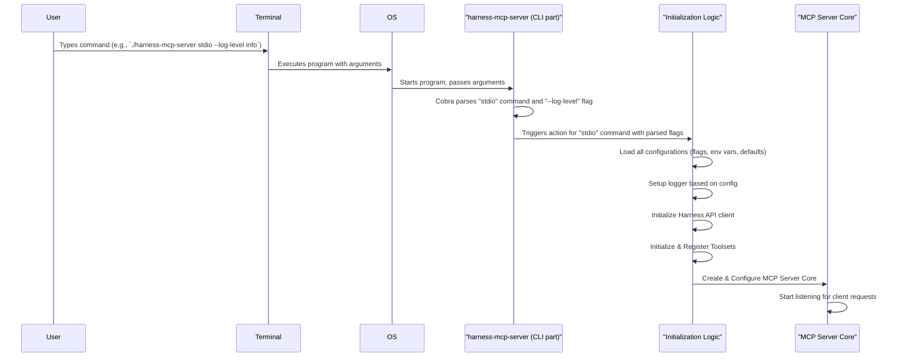

# Chapter 3: Command-Line Interface (CLI) & Initialization

In [Chapter 2: MCP Server Core](02_mcp_server_core_.md), we discovered the "engine" of our `harness-mcp` server – how it listens for requests and coordinates the work of our tools. But how do we actually turn this engine on? How do we tell it *how* to run, like what settings to use or which features to activate?

This is where the **Command-Line Interface (CLI)** and the server's **Initialization** process come in. Think of it like starting a car: you need an ignition key (the CLI command) and maybe some initial settings like turning on the headlights or adjusting the mirrors (CLI flags and configuration).

## Turning the Key: What is a CLI?

A Command-Line Interface (CLI) is a way to interact with a computer program by typing text commands into a terminal or console. Instead of clicking buttons in a graphical interface, you tell the program what to do by writing instructions.

For `harness-mcp`, the CLI is how you:
1.  **Start the server**: Tell it to begin listening for client connections.
2.  **Provide runtime settings**: Configure things like which set of tools to enable, how detailed the logs should be, or where to find your Harness API key.

This process of starting up and applying these initial settings is called **Initialization**. The CLI acts as the "ignition key" and the initial "setup wizard" for our server.

## Starting the Server: Commands and Flags

When you want to run `harness-mcp-server`, you'll open your terminal and type a command. The `harness-mcp` application uses a popular Go library called **Cobra** to define and manage its CLI.

A typical command to start the `harness-mcp` server looks like this:
```bash
./harness-mcp-server stdio --api-key YOUR_HARNESS_API_KEY --account-id YOUR_ACCOUNT_ID
```

Let's break this down:
*   `./harness-mcp-server`: This is the name of our executable program.
*   `stdio`: This is a **command**. It tells the server *how* it should run. In this case, `stdio` means it will communicate using Standard Input/Output, which is what we learned the [MCP Server Core](02_mcp_server_core_.md) uses.
*   `--api-key YOUR_HARNESS_API_KEY`: This is a **flag** (or option). Flags let you provide specific settings. Here, `--api-key` tells the server your Harness API key.
*   `--account-id YOUR_ACCOUNT_ID`: Another flag, specifying your Harness account ID.

Cobra helps our program understand these commands and flags, making sure the right actions are taken and the right settings are applied.

### Common Commands and Flags

The `harness-mcp-server` has a few important commands and flags:

*   **Command: `stdio`**
    *   This is the main command you'll use to start the server in its normal operating mode, listening for requests over standard input/output.

*   **Flag: `--help` (or `-h`)**
    *   You can use this with the main program or any command to see available options.
    *   Example: `./harness-mcp-server --help` or `./harness-mcp-server stdio --help`
    *   This is super useful for discovering what you can do!

*   **Flag: `--log-level <level>`**
    *   Sets how detailed the server's logs will be. Common levels are `debug`, `info`, `warn`, `error`.
    *   Example: `./harness-mcp-server stdio --log-level debug`

*   **Flag: `--api-key <your_key>`**
    *   Specifies your Harness API key. This is crucial for the server to talk to Harness.

*   **Flag: `--toolsets <set1,set2>`**
    *   Lets you choose which [Tools & Toolsets](01_tools___toolsets_.md) to enable. For example, `pipelines,pullrequests`. If not specified, it usually enables "all".

*   **Flag: `--read-only`**
    *   Starts the server in a mode where it won't perform any actions that change data (like creating a pull request).

## The Initialization Process: From Command to Running Server

When you hit "Enter" after typing your command, a series of steps happen to get the server up and running. This is the initialization sequence:

1.  **Parsing the Command**: The Cobra library takes your input (e.g., `stdio --log-level debug`) and figures out:
    *   Which command you want to run (e.g., `stdio`).
    *   What flags you've provided and their values (e.g., `log-level` is `debug`).

2.  **Loading Configuration**: The server gathers all its settings. These can come from:
    *   **Command-line flags** (highest priority).
    *   **Environment variables** (e.g., `HARNESS_API_KEY`).
    *   Default values coded into the program.
    (We'll dive deeper into this in [Chapter 4: Server Configuration](04_server_configuration_.md)).

3.  **Setting up Logging**: Based on the configuration (e.g., `--log-level` or `--log-file`), the server initializes its logging system. This means it decides where to write log messages (to the console, a file, or both) and how much detail to include.

4.  **Bootstrapping the Application**: This is where the core components are set up:
    *   The Harness API client (which allows the server to talk to Harness) is created.
    *   The [Tools & Toolsets](01_tools___toolsets_.md) are initialized and enabled based on the configuration.
    *   The [MCP Server Core](02_mcp_server_core_.md) is created and told about the available tools.

5.  **Launching the Server**: Finally, the [MCP Server Core](02_mcp_server_core_.md) starts listening for incoming client requests.

Here's a simplified diagram of this flow:



This entire process ensures that when the server starts, it's correctly configured and ready to do its job.

## Under the Hood: A Peek at `main.go`

The heart of the CLI and initialization logic resides in `cmd/harness-mcp-server/main.go`. Let's look at some simplified snippets to see how Cobra is used.

**1. Defining Commands:**
Cobra allows us to define commands. The `rootCmd` is the base command for `harness-mcp-server`, and `stdioCmd` is a subcommand.

```go
// Simplified from cmd/harness-mcp-server/main.go
package main

import (
	// ... other imports ...
	"github.com/spf13/cobra" // Cobra library
)

var rootCmd = &cobra.Command{
	Use:   "harness-mcp-server", // How the command is invoked
	Short: "Harness MCP Server",     // A short description
	// Version: "..." (version info is typically set here)
}

var stdioCmd = &cobra.Command{
	Use:   "stdio",
	Short: "Start stdio server",
	Long:  `Start a server that communicates via standard input/output.`,
	RunE: func(_ *cobra.Command, _ []string) error { // 'RunE' runs when 'stdio' is called
		// ... (1) Load configuration ...
		// ... (2) Call runStdioServer(config) ... (from Chapter 2)
		// This is where the server actually starts!
		return nil
	},
}
```
*   `rootCmd`: Represents the main `harness-mcp-server` program.
*   `stdioCmd`: Defines the `stdio` subcommand. The important part is `RunE`. This function is executed when a user types `./harness-mcp-server stdio`. Inside `RunE`, the application loads its configuration and then calls a function (like `runStdioServer` discussed in [Chapter 2: MCP Server Core](02_mcp_server_core_.md)) to actually start the server logic.

**2. Defining Flags:**
Flags are defined in an `init()` function. `PersistentFlags` are available to the command and all its subcommands.

```go
// Simplified from cmd/harness-mcp-server/main.go

func init() {
	// ... OnInitialize(initConfig) will be called (see below)

	// Add global flags to the rootCmd
	// These flags apply to 'harness-mcp-server' and any subcommands like 'stdio'
	rootCmd.PersistentFlags().String("api-key", "", "API key for authentication")
	rootCmd.PersistentFlags().String("log-file", "", "Path to log file")
	rootCmd.PersistentFlags().Bool("read-only", false, "Run in read-only mode")
	// ... other flags like --toolsets, --account-id, etc. ...

	// We also need to tell our configuration system (Viper) about these flags
	// _ = viper.BindPFlag("api_key", rootCmd.PersistentFlags().Lookup("api-key"))
	// ... (more on Viper in the next chapter) ...

	// Add the stdioCmd as a subcommand to rootCmd
	rootCmd.AddCommand(stdioCmd)
}
```
*   `rootCmd.PersistentFlags().String("api-key", "", "...")`: This defines a flag named `--api-key`.
    *   `"api-key"` is the name of the flag.
    *   `""` is its default value (if the user doesn't provide one).
    *   `"API key for authentication"` is the help description shown when the user types `--help`.
*   `rootCmd.AddCommand(stdioCmd)`: This tells Cobra that `stdio` is a valid action for `harness-mcp-server`.

**3. Initializing Configuration System (Viper):**
`harness-mcp` uses another library called Viper to manage configuration from flags, environment variables, and files. `initConfig` sets up Viper.

```go
// Simplified from cmd/harness-mcp-server/main.go
import (
	"github.com/spf13/viper" // Viper library for configuration
)

func initConfig() {
	// Tell Viper to look for environment variables prefixed with "HARNESS_"
	// e.g., HARNESS_API_KEY will match the 'api_key' config
	viper.SetEnvPrefix("harness")
	viper.AutomaticEnv() // Automatically read matching environment variables
}

// This function is registered in init() via cobra.OnInitialize(initConfig)
// It runs after Cobra parses flags but before the command's RunE executes.
```
This `initConfig` function, usually called via `cobra.OnInitialize(initConfig)`, sets up Viper to:
*   Recognize environment variables starting with `HARNESS_` (e.g., `HARNESS_API_KEY`).
*   Automatically load values from these environment variables if they are set.
*   Viper also works with the flags defined by Cobra. We'll explore this synergy more in [Chapter 4: Server Configuration](04_server_configuration_.md).

**4. Executing the Command:**
The `main()` function is the entry point of the program. It simply tells Cobra to do its magic.

```go
// Simplified from cmd/harness-mcp-server/main.go
import (
	"fmt"
	"os"
)

func main() {
	if err := rootCmd.Execute(); err != nil {
		fmt.Println(err) // Print any error reported by Cobra or our command
		os.Exit(1)     // Exit with an error status
	}
}
```
*   `rootCmd.Execute()`: This is the call that makes Cobra parse the command-line arguments, find the right command (like `stdioCmd`), execute its `RunE` function, and handle flags.

**5. Setting up the Logger:**
Inside the `stdioCmd.RunE` function (or a function it calls like `runStdioServer`), before the main server logic starts, the logger is configured:

```go
// Simplified from a function like runStdioServer in cmd/harness-mcp-server/main.go
import (
	"log/slog" // Go's structured logging package
	"os"
)

func initLogger(logFilePath string, debugMode bool) error {
	varlogOutput *os.File = os.Stdout // Default to standard output
	iflogFilePath != "" {
		file, err := os.OpenFile(logFilePath, os.O_CREATE|os.O_WRONLY|os.O_APPEND, 0666)
		if err != nil {
			return fmt.Errorf("failed to open log file: %w", err)
		}
		logOutput = file // Log to file if path is provided
	}

	handlerOpts := &slog.HandlerOptions{}
	if debugMode { // Check if debug flag was set
		handlerOpts.Level = slog.LevelDebug
	} else {
		handlerOpts.Level = slog.LevelInfo
	}

	logger := slog.New(slog.NewTextHandler(logOutput, handlerOpts))
	slog.SetDefault(logger) // Set this as the global logger
	slog.Info("Logger initialized.")
	return nil
}

// This initLogger function would be called early in stdioCmd.RunE or runStdioServer
// using configuration values (like cfg.LogFilePath, cfg.Debug)
// that were loaded from flags/env vars.
```
This function checks if a log file path was provided and if debug mode is enabled (these would come from the configuration loaded from flags or environment variables). It then sets up Go's `slog` package to log messages accordingly.

So, when you run `./harness-mcp-server stdio --log-level debug --api-key MY_KEY`, Cobra parses these, Viper helps load them into a configuration structure, `initLogger` sets up logging based on `--log-level`, and then the core server logic in `runStdioServer` uses `MY_KEY` to connect to Harness.

## Conclusion

You've now seen how the **Command-Line Interface (CLI)** acts as the entry point for `harness-mcp-server`. Using commands like `stdio` and flags like `--log-level` or `--api-key`, you control how the server starts and behaves. The **Cobra** library makes defining this CLI straightforward, and it kicks off the **initialization** process: loading settings, preparing logging, and finally launching the [MCP Server Core](02_mcp_server_core_.md).

This "ignition system" is crucial because it bridges the gap between you, the user, and the complex machinery inside the server. But how exactly are all those configurations from flags and environment variables managed and made available throughout the application? That's what we'll explore in the next chapter.

Next up: [Chapter 4: Server Configuration](04_server_configuration_.md)