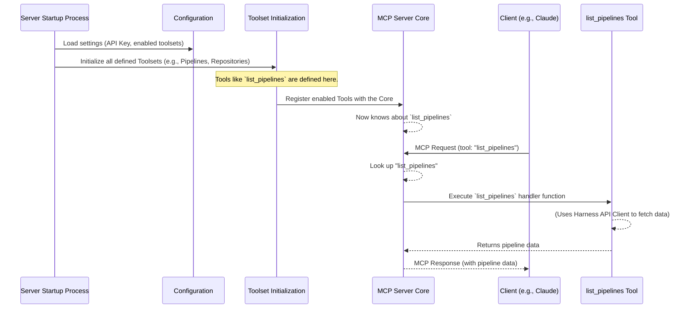

# Chapter 3: Tools and Toolsets

In [Chapter 2: Configuration Management](02_configuration_management_.md), we saw how `mcp-server` gets its initial settings, like API keys and default project IDs. This setup is crucial, like a chef preparing their kitchen before cooking. But what dishes can our chef actually make? What specific tasks can `mcp-server` perform once it's configured? That's where **Tools and Toolsets** come into play!

## What's the Big Idea? The Server's Capabilities

Imagine a well-organized carpenter's workshop. There isn't just a pile of random equipment. Instead, you'd find:
*   Drawers and cabinets labeled with categories like "Drills," "Saws," or "Measuring Tapes." These are like **Toolsets**.
*   Inside each drawer, specific instruments for particular jobs: a "3mm drill bit," a "crosscut saw," a "25-foot measuring tape." These are like **Tools**.

**Tools and Toolsets** in `mcp-server` define the actual actions the server can perform.
*   A **Tool** represents a single, specific capability. For example, `get_pipeline` is a tool that fetches details for one pipeline, and `list_pull_requests` is a tool that lists pull requests. Each tool is like a specific drill bit, designed for a precise task.
*   A **Toolset** is a collection of related tools. For instance, the "Pipelines Toolset" groups together tools like `get_pipeline`, `list_pipelines`, and `get_execution`. This is like the "Drills" drawer, holding all drilling-related instruments.

When a client (like an AI assistant or another program) wants `mcp-server` to do something, it asks the server to execute a specific tool. The [MCP Server Core](01_mcp_server_core_.md) then acts like the carpenter, finding the right tool from the right toolset based on the client's request.

**Use Case: Listing Your Pipelines**

Let's say you, or a client program like Claude, want to see a list of all pipelines in your Harness project. The client needs to tell `mcp-server`: "Please use your `list_pipelines` ability." The `mcp-server` then needs to know:
1.  What "list_pipelines" means.
2.  What code to run to actually get that list from Harness.

Tools and Toolsets provide this organization and mapping from a requested action name to the code that performs the action.

## Key Concepts: Tools and Toolsets Explained

Let's break these down a bit more.

### 1. What is a "Tool"?

A **Tool** is the smallest unit of functionality in `mcp-server`. It's a single, well-defined action the server can take. Think of it as a single function or command.

*   **Examples:**
    *   `get_pipeline`: Fetches details for *one* specific pipeline.
    *   `list_repositories`: Provides a list of *multiple* repositories.
    *   `create_pull_request`: Performs an action to *create* something.

Each tool has:
*   A unique **name** (e.g., `get_pipeline`). This is what clients use to request it.
*   A **description** of what it does.
*   A definition of any **parameters** it needs to do its job (we'll cover this in detail in [Tool Parameter Handling](05_tool_parameter_handling_.md)). For example, `get_pipeline` needs a `pipeline_id`.
*   The actual **code (handler function)** that gets executed when the tool is called. This code often uses the [Harness API Client](06_harness_api_client_.md) to talk to Harness.

### 2. What is a "Toolset"?

A **Toolset** is simply a logical grouping of related Tools. This helps organize the server's capabilities and can also be used to enable or disable entire categories of functionality.

*   **Examples from `mcp-server` (as seen in `README.md`):**
    *   **Pipelines Toolset:** Contains tools like `get_pipeline`, `list_pipelines`, `get_execution`, `list_executions`, etc. All related to pipeline operations.
    *   **Pull Requests Toolset:** Contains `get_pull_request`, `list_pull_requests`, `create_pull_request`, etc.
    *   **Repositories Toolset:** Contains `get_repository`, `list_repositories`.
    *   **Logs Toolset:** Contains `download_execution_logs`.

Think of it like folders on your computer. You put all your "Vacation Photos" (Tools) into a "Photos" (Toolset) folder, not mixed in with your "Work Documents."

You can enable or disable entire toolsets using [Configuration Management](02_configuration_management_.md) (e.g., via the `HARNESS_TOOLSETS` environment variable or the `--toolsets` flag). If a toolset is disabled, none of its tools will be available.

## How Tools and Toolsets Solve Our Use Case (Listing Pipelines)

Let's go back to wanting to list pipelines:

1.  **Client Request:** You (or Claude) send an MCP request to the server. This request will essentially say: "I want to execute the tool named `list_pipelines`." (We'll see the exact format later, but the tool name is key).

2.  **Server Receives Request:** The [MCP Server Core](01_mcp_server_core_.md) gets this message.

3.  **Server Finds the Tool:**
    *   The Server Core looks at its list of all *registered* and *enabled* tools.
    *   It finds the `list_pipelines` tool. It knows this tool belongs to the "Pipelines Toolset."

4.  **Server Executes the Tool:**
    *   The Server Core calls the specific code function associated with the `list_pipelines` tool.
    *   This function (the tool's handler) might then:
        *   Check for any required parameters (though `list_pipelines` might not need many).
        *   Use the [Harness API Client](06_harness_api_client_.md) to make an API call to your Harness account.
        *   Get the list of pipelines from Harness.

5.  **Server Returns Response:** The tool's code returns the list of pipelines (or an error) to the Server Core, which then packages it into an MCP response and sends it back to the client.

The Tools and Toolsets system ensures that the request "execute `list_pipelines`" is correctly routed to the piece of code that knows how to list Harness pipelines.

## Under the Hood: How the Server Finds and Uses Tools

When `mcp-server` starts up, it needs to know about all the tools it *could* offer.

### High-Level Flow: From Startup to Tool Execution



### Diving into the Code: Defining and Registering Tools

Let's see simplified examples of how this looks in the `mcp-server` code.

**1. Defining a Single Tool**

Each tool is defined using functions provided by the `mcp-go` library. This usually happens in files specific to a category, like `pkg/harness/pipelines.go` for pipeline-related tools.

Here's a very simplified look at how the `get_pipeline` tool might be defined:

```go
// From pkg/harness/pipelines.go (highly simplified)
import (
	"github.com/mark3labs/mcp-go/mcp"      // Core MCP types
	"github.com/mark3labs/mcp-go/server" // MCP server library
	// ... other imports ...
)

// GetPipelineTool defines the "get_pipeline" tool
func GetPipelineTool(config *config.Config, apiClient *client.Client) (mcp.Tool, server.ToolHandlerFunc) {
	// mcp.NewTool creates the tool definition
	tool := mcp.NewTool("get_pipeline", // The unique name clients will use
		mcp.WithDescription("Get details of a specific pipeline..."),
		mcp.WithString("pipeline_id", // Defines a required string parameter
			mcp.Required(),
			mcp.Description("The ID of the pipeline"),
		),
		// ... other options like scope parameters ...
	)

	// This is the function that runs when the tool is called
	handler := func(ctx context.Context, request mcp.CallToolRequest) (*mcp.CallToolResult, error) {
		// 1. Get the 'pipeline_id' parameter from the request
		//    (More on this in [Tool Parameter Handling](05_tool_parameter_handling_.md))
		// 2. Use the apiClient (Harness API Client) to fetch pipeline data from Harness
		// 3. Format the data and return it as a mcp.CallToolResult
		// ... implementation details ...
		pipelineID, _ := request.Params.GetString("pipeline_id")
		data, _ /* err */ := apiClient.Pipelines.Get(ctx, /* scope */ nil, pipelineID)
		// ... marshal data to JSON and return ...
		return mcp.NewToolResultText("pipeline data as JSON string"), nil
	}
	return tool, handler
}
```
In this snippet:
*   `mcp.NewTool("get_pipeline", ...)`: This declares a new tool named "get_pipeline".
*   `mcp.WithDescription(...)`: Sets a human-readable description.
*   `mcp.WithString("pipeline_id", mcp.Required(), ...)`: Specifies that this tool needs a string parameter named `pipeline_id`.
*   The `handler` function is the actual code that will be executed. It receives the request details and is responsible for performing the action and returning a result.

Other tools like `list_pipelines` (from `pkg/harness/pipelines.go`) or `get_pull_request` (from `pkg/harness/pullreq.go`) are defined similarly.

**2. Grouping Tools into Toolsets**

Related tools are then grouped into Toolsets. This typically happens in a central place, like `pkg/harness/tools.go`.

```go
// From pkg/harness/tools.go (simplified)
import (
	"github.com/harness/harness-mcp/pkg/toolsets" // Our project's toolset logic
	// ... other imports for client, config ...
)

// InitToolsets initializes all available toolsets
func InitToolsets(apiClient *client.Client, config *config.Config) (*toolsets.ToolsetGroup, error) {
	tsg := toolsets.NewToolsetGroup(config.ReadOnly) // Create a group to hold all toolsets

	// Create the "pipelines" toolset
	pipelinesToolset := toolsets.NewToolset("pipelines", "Harness Pipeline related tools").
		AddReadTools( // Add tools that primarily read data
			toolsets.NewServerTool(GetPipelineTool(config, apiClient)),       // from pipelines.go
			toolsets.NewServerTool(ListPipelinesTool(config, apiClient)),     // from pipelines.go
			toolsets.NewServerTool(GetExecutionTool(config, apiClient)),      // from pipelines.go
			// ... other pipeline read tools ...
		)
		// .AddWriteTools(...) for tools that change data (if any for this toolset)

	// Create the "pullrequests" toolset similarly
	pullRequestsToolset := toolsets.NewToolset("pullrequests", "Harness Pull Request tools").
		AddReadTools(
			toolsets.NewServerTool(GetPullRequestTool(config, apiClient)),   // from pullreq.go
			// ...
		).
		AddWriteTools(
			toolsets.NewServerTool(CreatePullRequestTool(config, apiClient)), // from pullreq.go
			// ...
		)

	// Add the defined toolsets to the group
	tsg.AddToolset(pipelinesToolset)
	tsg.AddToolset(pullRequestsToolset)
	// ... add other toolsets like Repositories, Logs ...

	// Enable toolsets based on configuration (e.g., HARNESS_TOOLSETS)
	// This comes from [Configuration Management](02_configuration_management_.md)
	if err := tsg.EnableToolsets(config.Toolsets); err != nil {
		return nil, err
	}
	return tsg, nil
}
```
Here:
*   `toolsets.NewToolsetGroup(...)`: Creates a container for all our toolsets.
*   `toolsets.NewToolset("pipelines", ...)`: Defines a new toolset named "pipelines".
*   `.AddReadTools(...)`: Adds tools that are generally safe and don't modify data. `NewServerTool` just bundles the tool definition and its handler function.
*   `.AddWriteTools(...)`: Adds tools that might modify data (like `create_pull_request`). These might be disabled if the server is in read-only mode (a setting from [Configuration Management](02_configuration_management_.md)).
*   `tsg.AddToolset(...)`: Adds the fully defined toolset to the main group.
*   `tsg.EnableToolsets(config.Toolsets)`: This is crucial! It checks the server's configuration (e.g., what you set with `HARNESS_TOOLSETS="pipelines,repositories"`) and enables only the requested toolsets. If a toolset isn't enabled, its tools won't be available.

The actual `Toolset` and `ToolsetGroup` structures are defined in `pkg/toolsets/toolsets.go`. They manage the collections of tools and whether they are active.

**3. Making Toolsets (and their Tools) Available to the Server**

Once `InitToolsets` has prepared all the toolset definitions and figured out which ones are enabled based on the configuration, these enabled tools need to be "registered" with the [MCP Server Core](01_mcp_server_core_.md).

This registration typically happens when the server is starting up, as we saw a glimpse of in Chapter 1. The `ToolsetGroup` has a method to do this:

```go
// From pkg/toolsets/toolsets.go (conceptual method of ToolsetGroup)
// func (tg *ToolsetGroup) RegisterTools(s *server.MCPServer) {
// 	for _, toolset := range tg.Toolsets {
// 		if toolset.Enabled { // Only register tools from enabled toolsets
// 			activeTools := toolset.GetActiveTools() // Gets read/write tools based on read-only mode
// 			for _, serverTool := range activeTools {
// 				s.AddTool(serverTool.Tool, serverTool.Handler) // Tell the MCP Server Core about this tool
// 			}
// 		}
// 	}
// }
```
The `s.AddTool(toolDefinition, toolHandler)` line is where the magic happens. It tells the underlying `mcp-go` server library: "Here's a tool named `X`, and here's the function you should call when someone asks for `X`."

This `RegisterTools` method of the `ToolsetGroup` would be called within the `runStdioServer` function we looked at in [Chapter 1: MCP Server Core](01_mcp_server_core_.md), after `harness.InitToolsets()` returns the `toolsets` object:

```go
// Recall from cmd/harness-mcp-server/main.go's runStdioServer (simplified)
// ...
// toolsets, _ := harness.InitToolsets(apiClient, &config)
// toolsets.RegisterTools(harnessServer) // This is where all enabled tools become known to the server
// ...
```

So, by the time the server is ready to listen for requests, it has a complete map of all tool names it supports and the corresponding functions to execute for each.

## Conclusion

Tools and Toolsets are the heart of what `mcp-server` can *do*. They provide a structured way to define, organize, and manage the server's individual capabilities.
*   **Tools** are the specific actions (e.g., `get_pipeline`).
*   **Toolsets** are logical groups of these actions (e.g., "Pipelines Toolset").

When a client sends a request specifying a tool name, the [MCP Server Core](01_mcp_server_core_.md) uses this system to find and execute the correct piece of code. The availability of these tools and toolsets can be controlled via [Configuration Management](02_configuration_management_.md).

Now that we understand what tools are and how they're organized, we need to consider what information they operate on. Tools often need to know *which* pipeline, or *which* project they should target. This brings us to the concept of "scope." In the next chapter, we'll explore [Scope Management (Account, Org, Project)](04_scope_management__account__org__project__.md).