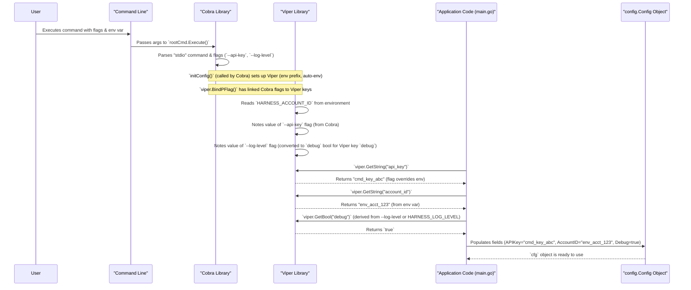

# Chapter 4: Server Configuration

In [Chapter 3: Command-Line Interface (CLI) & Initialization](03_command_line_interface__cli____initialization_.md), we saw how to start the `harness-mcp` server and provide some initial instructions using commands and flags. But how does the server keep track of all these settings? What if you want to use different API keys for different Harness accounts, or specify which tools should be active, without changing the server's code every time?

This is where **Server Configuration** comes in. It's the server's "control panel" and "identity card," managing all the settings it needs to run correctly and connect to Harness.

## The Server's Control Panel: What Problem Does Configuration Solve?

Imagine you're a chef, and the `harness-mcp` server is your amazing, multi-talented cooking robot.
*   Sometimes, you want it to prepare a meal for your "development kitchen" (a test Harness account). It needs a specific set of keys to access that kitchen's pantry (API key for the dev account).
*   Other times, you want it to cook for the "production restaurant" (your live Harness account). This requires different keys and perhaps only a specific set of "cooking tools" (toolsets) to be active for safety.
*   You might also want to tell it how loudly it should announce its actions (logging preferences).

Server Configuration allows you to easily tell your "robot chef" these crucial details each time it starts, without needing to reprogram its core. It makes the server adaptable to different environments and Harness instances. It manages:
*   **Identity**: API keys, Harness account, organization, and project identifiers.
*   **Behavior**: Which [Tools & Toolsets](01_tools___toolsets_.md) should be active.
*   **Operations**: Logging preferences (like log level or log file path) and whether it should run in read-only mode.

The `harness-mcp` server is designed to read these settings from two main places:
1.  **Command-Line Arguments (Flags)**: Like telling the chef "use the 'extra sharp' knife today" via a direct instruction.
2.  **Environment Variables**: Like putting a note on the kitchen whiteboard saying "Pantry Key for today: DEV_PANTRY_KEY."

## How `harness-mcp` Manages Settings: The Key Players

Three main components work together to handle configuration in `harness-mcp`:

1.  **Cobra (from Chapter 3)**: This library helps define and parse command-line flags (like `--api-key` or `--log-level`). It's the first point of contact for settings you provide when starting the server.
2.  **Viper**: This is a powerful Go library that complements Cobra. Viper can:
    *   Read settings from environment variables (e.g., `HARNESS_API_KEY`).
    *   Work with the flags defined by Cobra.
    *   Establish an order of precedence (e.g., a command-line flag will override an environment variable, which will override a default value).
3.  **The `config.Config` Struct**: This is a Go data structure (defined in `cmd/harness-mcp-server/config/config.go`) that acts as a container. Once Cobra and Viper have gathered all the settings, they are neatly stored in an instance of this struct. This `Config` object is then passed around to different parts of the server that need to know these settings.

Think of it like this: Cobra takes your direct orders (flags). Viper checks the whiteboard (environment variables) and also listens to Cobra. Then, all these instructions are written down on a single "daily briefing sheet" (the `config.Config` struct) for everyone in the kitchen to use.

## Where Do Settings Come From? The Order of Importance

`harness-mcp` can get its settings from several places. Viper helps manage this by following a specific order of priority:

1.  **Command-Line Flags**: What you type directly when running the server.
    *   Example: `./harness-mcp-server stdio --api-key "flag_api_key_123"`
    *   These have the **highest priority**.
2.  **Environment Variables**: Variables set in your terminal's environment before you run the server.
    *   Example: `export HARNESS_API_KEY="env_api_key_abc"` (on Linux/macOS)
    *   `./harness-mcp-server stdio` (server then reads `HARNESS_API_KEY` from the environment)
    *   These are used if a corresponding flag isn't provided.
3.  **Default Values**: If a setting isn't provided by a flag or an environment variable, the server might use a pre-defined default value.
    *   Example: The `--base-url` flag defaults to `"https://app.harness.io"` if you don't specify it.

**Example Scenario**:
*   You set an environment variable: `export HARNESS_API_KEY="env_key_abc"`
*   You run the server with a flag: `./harness-mcp-server stdio --api-key "cmd_key_123"`

In this case, the server will use `"cmd_key_123"` for the API key because the command-line flag has higher priority than the environment variable.

## The `config.Config` Struct: The Server's Briefing Sheet

All the configuration values, once collected and prioritized by Cobra and Viper, are stored in a simple Go struct. This makes it easy for other parts of the server to access them in a consistent way.

Here's a simplified look at its definition from `cmd/harness-mcp-server/config/config.go`:
```go
// Simplified from cmd/harness-mcp-server/config/config.go
package config

type Config struct {
	Version     string   // Server version
	BaseURL     string   // Harness API base URL
	AccountID   string   // Harness Account ID
	OrgID       string   // Harness Organization ID
	ProjectID   string   // Harness Project ID
	APIKey      string   // Harness API Key
	ReadOnly    bool     // Run in read-only mode?
	Toolsets    []string // List of enabled toolsets
	LogFilePath string   // Path to the log file
	Debug       bool     // Is debug logging enabled?
}
```
*   This `Config` struct is like a neatly organized form. Each field (`BaseURL`, `APIKey`, etc.) holds one specific piece of configuration.
*   When the server starts, an instance of this `Config` struct is created and filled with the values from flags, environment variables, or defaults. This `Config` object is then passed to functions that need these settings. For instance, the code that initializes the [Harness API Client](05_harness_api_client_.md) will read `APIKey`, `AccountID`, etc., from this `Config` object.

## How Configuration is Loaded: A Step-by-Step

Let's revisit the startup process from [Chapter 3: Command-Line Interface (CLI) & Initialization](03_command_line_interface__cli____initialization_.md), but this time focusing on how Cobra and Viper work together to populate our `config.Config` struct. This primarily happens in `cmd/harness-mcp-server/main.go`.

**Step 1: Defining Flags with Cobra**
In the `init()` function of `main.go`, command-line flags are defined.
```go
// Simplified from cmd/harness-mcp-server/main.go (init function)
rootCmd.PersistentFlags().String("api-key", "", "API key for authentication")
rootCmd.PersistentFlags().String("account-id", "", "Account ID to use")
// ... other flags like --log-file, --toolsets, --read-only ...
```
This tells Cobra about flags like `--api-key`. The `""` means if the user doesn't provide `--api-key`, its initial value is an empty string (before Viper checks environment variables or defaults).

**Step 2: Connecting Viper to Cobra Flags**
Also in the `init()` function, Viper is told to "be aware" of these Cobra flags.
```go
// Simplified from cmd/harness-mcp-server/main.go (init function)
_ = viper.BindPFlag("api_key", rootCmd.PersistentFlags().Lookup("api-key"))
_ = viper.BindPFlag("account_id", rootCmd.PersistentFlags().Lookup("account-id"))
// ... binding for other flags ...
```
*   `viper.BindPFlag("api_key", ...)` links Viper's internal configuration key `api_key` to the Cobra flag named `api-key`. Now, Viper knows that if the `--api-key` flag is used, its value should be stored under the name `api_key`. (Note the slight name difference: `api-key` in flag, `api_key` in Viper usually).

**Step 3: Telling Viper to Read Environment Variables**
The `initConfig()` function (called by `cobra.OnInitialize(initConfig)`) sets up Viper to look for environment variables.
```go
// Simplified from cmd/harness-mcp-server/main.go
func initConfig() {
	viper.SetEnvPrefix("harness") // Look for env vars starting with HARNESS_
	viper.AutomaticEnv()         // Automatically read them
}
```
*   `viper.SetEnvPrefix("harness")`: Viper will look for environment variables like `HARNESS_API_KEY`, `HARNESS_ACCOUNT_ID`.
*   `viper.AutomaticEnv()`: Viper automatically loads any matching environment variables it finds. It cleverly matches `HARNESS_API_KEY` to the `api_key` name it knows from `BindPFlag` or other Viper settings.

**Step 4: Populating the `config.Config` Struct**
When the `stdioCmd` is run (its `RunE` function in `main.go`), Viper is used to retrieve the final values, and these are used to create the `config.Config` object.
```go
// Simplified from stdioCmd.RunE in cmd/harness-mcp-server/main.go
// ...
apiKey := viper.GetString("api_key") // Get 'api_key' value from Viper
if apiKey == "" {
    return fmt.Errorf("API key not provided")
}
// ...
cfg := config.Config{
    Version:     version, // A global variable in main.go
    BaseURL:     viper.GetString("base_url"),
    AccountID:   viper.GetString("account_id"),
    OrgID:       viper.GetString("org_id"),
    ProjectID:   viper.GetString("project_id"),
    APIKey:      apiKey, // Use the retrieved apiKey
    ReadOnly:    viper.GetBool("read_only"),
    // ... unmarshal toolsets ...
    LogFilePath: viper.GetString("log_file"),
    Debug:       viper.GetBool("debug"),
}
// Now 'cfg' holds all the resolved configurations.
// This 'cfg' object is then passed to runStdioServer(cfg).
// ...
```
*   `viper.GetString("api_key")`: This asks Viper for the value associated with the key `api_key`. Viper checks its sources in order:
    1.  Was `--api-key` flag used? If yes, use its value.
    2.  Else, is `HARNESS_API_KEY` environment variable set? If yes, use its value.
    3.  Else (if no default was set for `api-key`), it might be an empty string or cause an error if required (like the API key here).
*   The `cfg` variable of type `config.Config` is then filled with all these resolved values.

This `cfg` object now acts as the single source of truth for configuration throughout the server's runtime.

## Using the Configuration

Once the `cfg` object is populated, it's passed to various parts of the application. For example:

1.  **Initializing the Logger**:
    The `runStdioServer` function in `main.go` calls `initLogger`:
    ```go
    // Simplified from runStdioServer in cmd/harness-mcp-server/main.go
    err := initLogger(config.LogFilePath, config.Debug) // Uses cfg.LogFilePath, cfg.Debug
    if err != nil {
        // ... handle error ...
    }
    ```
    The `initLogger` function uses `config.LogFilePath` to know where to write logs and `config.Debug` to set the log level.

2.  **Initializing [Tools & Toolsets](01_tools___toolsets_.md)**:
    ```go
    // Simplified from runStdioServer in cmd/harness-mcp-server/main.go
    // ... (Harness API Client 'client' is created using config.APIKey, config.BaseURL) ...
    toolsets, err := harness.InitToolsets(client, &config) // Passes the whole config
    if err != nil {
        // ... handle error ...
    }
    toolsets.RegisterTools(harnessServer)
    ```
    The `harness.InitToolsets` function (from `pkg/harness/tools.go`) uses `config.Toolsets` to know which toolsets to enable and `config.ReadOnly` to configure their behavior.

3.  **Creating the [Harness API Client](05_harness_api_client_.md)**:
    ```go
    // Simplified from runStdioServer in cmd/harness-mcp-server/main.go
    apiClient, err := client.NewWithToken(config.BaseURL, config.APIKey)
    if err != nil {
        // ... handle error ...
    }
    ```
    The API client needs the `config.BaseURL` and `config.APIKey` to connect to the correct Harness instance with proper authentication. The `config.AccountID`, `config.OrgID`, and `config.ProjectID` are also often used by tools when making API calls.

## Under the Hood: Configuration Loading Flow

Let's visualize the configuration loading process when you run a command like:
`HARNESS_ACCOUNT_ID="env_acct_123" ./harness-mcp-server stdio --api-key "cmd_key_abc" --log-level debug`


This `cfg` object is then passed to `runStdioServer`, which uses it to configure the rest of the server components.

## Conclusion

Server Configuration is the mechanism that makes `harness-mcp` flexible and adaptable. By combining **Cobra** for command-line flags, **Viper** for handling environment variables and value precedence, and the **`config.Config` struct** as a central holder of settings, the server can be easily tailored to various operational needs without code changes. You can specify API keys, target Harness scopes (account, org, project), choose active toolsets, and control logging, all through external settings.

Now that our server is properly configured and knows its identity (like which Harness account and API key to use), it needs a way to actually communicate with Harness services. How does it make API calls to fetch pipeline details or list repositories? That's what we'll explore in the next chapter.

Next up: [Chapter 5: Harness API Client](05_harness_api_client_.md)