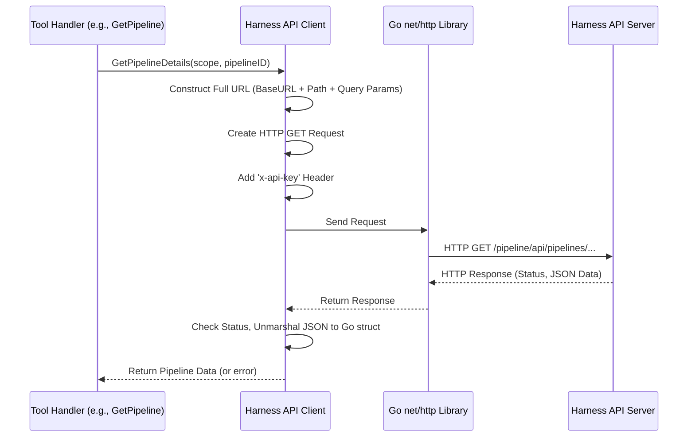

# Chapter 5: Harness API Client

In [Chapter 4: Server Configuration](04_server_configuration_.md), we learned how `harness-mcp` gets all its important settings, like API keys and which Harness account to talk to. This is like preparing your courier with the destination address and the special keys needed to enter the building. But once our server knows *what* to do (from the [Tools & Toolsets](01_tools___toolsets_.md)) and *how* it's configured (from [Server Configuration](04_server_configuration_.md)), how does it actually send messages to and receive information from the Harness platform?

This is where the **Harness API Client** steps in.

## The Dedicated Courier: What is the Harness API Client?

Imagine our `harness-mcp` server needs to fetch details about a specific pipeline from your Harness account. It can't just magically know this information. It needs to *ask* Harness for it.

The **Harness API Client** is like a specialized, highly reliable courier service built right into `harness-mcp`. This courier's only job is to carry messages (requests) to the Harness platform and bring back replies (responses).

This "courier" is very smart:
*   **Knows the Address**: It knows the base web address (URL) of the Harness platform (you configured this in [Chapter 4: Server Configuration](04_server_configuration_.md)).
*   **Has the Keys**: It uses the API key (also from your configuration) to securely authenticate itself, proving it's allowed to access your Harness data.
*   **Understands the Routes**: For different tasks (like getting pipeline details, listing pull requests, or fetching repository info), it knows the specific "API endpoints" or paths to use. For example, `/api/pipelines/...` or `/api/code/repos/...`.
*   **Follows Protocol**: It speaks the language of the web – HTTP – sending requests and understanding responses, including any data (usually in a format called JSON) or error messages.
*   **Delivers the Package**: It takes the information it receives from Harness and delivers it back to the part of `harness-mcp` that asked for it (usually one of the [Tools & Toolsets](01_tools___toolsets_.md)).

So, whenever a tool in `harness-mcp` needs to interact with Harness (to get data or tell Harness to do something), it doesn't make the web call itself. Instead, it hands the request to the Harness API Client, our trusted courier.

## How Tools Use the API Client

Let's say you're using a tool like `get_pipeline` which is designed to fetch details for a specific pipeline. Here's how it uses the Harness API Client:

1.  **Tool Gets a Request**: The [MCP Server Core](02_mcp_server_core_.md) tells the `get_pipeline` tool, "Hey, the user wants details for pipeline 'my_awesome_pipeline' in project 'my_project'."
2.  **Tool Asks the Courier**: The `get_pipeline` tool doesn't know how to talk to Harness directly. So, it turns to the Harness API Client. It says, "Mr. API Client, please fetch me details for pipeline 'my_awesome_pipeline' in project 'my_project' (and here's the account and org info)."
3.  **API Client Does the Work**: The API Client takes this request, figures out the correct Harness API URL, adds the necessary authentication (your API key), sends the HTTP request to Harness, waits for the response, and then decodes it.
4.  **API Client Returns to Tool**: The API Client hands the pipeline details (or an error message if something went wrong) back to the `get_pipeline` tool.
5.  **Tool Responds to User**: The `get_pipeline` tool then gives these details back to the [MCP Server Core](02_mcp_server_core_.md), which sends them to the original requester (e.g., an AI assistant).

### Example: A Tool Using the Client

Let's look at a very simplified piece of code that might be inside a tool's handler function. This is how a tool might use the API Client to get pipeline details.

```go
// Simplified snippet from a tool's handler
// (Actual tool handlers are more complex, see pkg/harness/pipelines.go)

// 'apiClient' is our Harness API Client instance, created during server startup
// 'scope' contains accountID, orgID, projectID
// 'pipelineID' is the ID of the pipeline we want

pipelineDetails, err := apiClient.Pipelines.Get(ctx, scope, pipelineID)
if err != nil {
    // Handle the error, maybe tell the user something went wrong
    return nil, fmt.Errorf("Failed to get pipeline: %w", err)
}

// Now 'pipelineDetails' contains the information fetched from Harness.
// The tool can use this data to form a response.
slog.Info("Successfully fetched pipeline", "name", pipelineDetails.Data.Name)
// ... return pipelineDetails ...
```
In this snippet:
*   `apiClient`: This is an instance of our Harness API Client (from the `client` package). It was created when the server started, using the API key and base URL from your [Server Configuration](04_server_configuration_.md).
*   `apiClient.Pipelines`: The API Client is organized. It has sub-services for different parts of Harness. `Pipelines` is the service dedicated to pipeline-related API calls.
*   `.Get(ctx, scope, pipelineID)`: This is a specific function call to get pipeline details. The tool provides:
    *   `ctx`: A context object (for managing timeouts and cancellations, a standard Go thing).
    *   `scope`: Information like Harness Account ID, Org ID, and Project ID, telling the client *where* to look for the pipeline. We'll learn more about this in [Chapter 6: Scope Handling](06_scope_handling_.md).
    *   `pipelineID`: The specific pipeline we're interested in.
*   `pipelineDetails`: If successful, this variable will hold the data returned by Harness, neatly packaged.
*   `err`: If anything goes wrong (network issue, bad API key, pipeline not found), `err` will describe the problem.

The important thing is that the tool doesn't care about HTTP, JSON, or API keys directly. It just uses the convenient `apiClient.Pipelines.Get()` method.

## Under the Hood: The Courier's Journey

When a tool calls a method on the Harness API Client like `apiClient.Pipelines.Get(...)`, what actually happens? Let's follow our courier:

1.  **Receive the Order**: The `Pipelines.Get()` method in `client/pipelines.go` receives the call from the tool.
2.  **Prepare the Route**:
    *   It knows the base URL for Harness (e.g., `https://app.harness.io/`) from the client's configuration.
    *   It knows the specific path for getting a pipeline (e.g., `pipeline/api/pipelines/{pipeline_id}`).
    *   It constructs the full URL, adding query parameters for account, org, and project IDs from the `scope`. The URL might look like: `https://app.harness.io/pipeline/api/pipelines/my_awesome_pipeline?accountIdentifier=XYZ&orgIdentifier=default&projectIdentifier=my_project`.
3.  **Pack the Secure Envelope**:
    *   It creates an HTTP GET request for that URL.
    *   Crucially, it adds your Harness API key to the request headers (typically a header like `x-api-key`). This is how Harness authenticates the request.
4.  **Dispatch and Wait**:
    *   It uses Go's built-in `net/http` package to send this request over the internet to the Harness platform.
    *   It then waits for Harness to process the request and send back a response.
5.  **Receive and Unpack**:
    *   Harness sends back an HTTP response. This includes a status code (like `200 OK` if successful, or `404 Not Found` if the pipeline doesn't exist) and, if successful, the pipeline data in JSON format.
    *   The API Client checks the status code. If it's an error code, it tries to create a meaningful Go error.
    *   If successful, it reads the JSON data from the response body.
    *   It then "unmarshals" (converts) this JSON data into a Go data structure (like `dto.PipelineData` from [Chapter 7: Data Transfer Objects (DTOs)](07_data_transfer_objects__dtos_.md)).
6.  **Deliver the Result**: The API Client returns this Go data structure (or the error) back to the tool that originally called it.

Here's a simplified diagram of this flow:



## Diving Deeper into the Client's Code

Let's peek at some (very simplified) code from the `client` package to see these steps in action.

**1. The Main Client (`client/client.go`)**

The `Client` struct is the core of our API client. It holds the HTTP client, the base URL, and your API key.

```go
// Simplified from client/client.go
package client

import (
	"net/http"
	"net/url"
	// ... other imports ...
)

var apiKeyHeader = "x-api-key" // The header name for the API key

type Client struct {
	client  *http.Client // Standard Go HTTP client
	BaseURL *url.URL     // e.g., https://app.harness.io/
	APIKey  string       // Your Harness API key

	// Services for different Harness areas
	Pipelines    *PipelineService
	PullRequests *PullRequestService
	Repositories *RepositoryService
	// ... and other services ...
}

// NewWithToken creates a new API client.
// This is called during server startup using settings from config.Config.
func NewWithToken(baseURL, apiKey string) (*Client, error) {
	parsedURL, _ := url.Parse(baseURL) // Simplified error handling
	c := &Client{
		client:  &http.Client{Timeout: 10 * time.Second}, // Basic HTTP client
		BaseURL: parsedURL,
		APIKey:  apiKey,
	}
	c.initializeServices() // Sets up c.Pipelines, c.PullRequests etc.
	return c, nil
}

func (c *Client) initializeServices() {
    // Simplified: In reality, these services are structs that also hold a pointer to 'c'
	c.Pipelines = &PipelineService{client: c}
	c.PullRequests = &PullRequestService{client: c}
	c.Repositories = &RepositoryService{client: c}
	// ... initialize other services ...
}
```
*   `Client` struct: Stores the essential components.
*   `NewWithToken`: This function is how the `harness-mcp` server creates the API client instance when it starts, using the `BaseURL` and `APIKey` from the [Server Configuration](04_server_configuration_.md).
*   `initializeServices()`: This sets up the specific service helpers like `c.Pipelines`. Each of these services (like `PipelineService`) will use the main `Client`'s `BaseURL`, `APIKey`, and `http.Client` to do its work.

**2. Making a GET Request (`client/client.go`)**

The `Client` struct has methods like `Get` and `Post` to perform actual HTTP calls.

```go
// Simplified from client/client.go

// Get makes an HTTP GET request
func (c *Client) Get(ctx context.Context, path string, params map[string]string, responseData interface{}) error {
	// 1. Construct the full URL
	// appendPath combines c.BaseURL + path
	// addQueryParams adds key-value pairs from 'params' to the URL
	fullURL := appendPath(c.BaseURL.String(), path)
	httpReq, _ := http.NewRequestWithContext(ctx, http.MethodGet, fullURL, nil)
	addQueryParams(httpReq, params) // Adds ?accountIdentifier=...&orgIdentifier=... etc.

	// 2. Add the API key header for authentication
	httpReq.Header.Add(apiKeyHeader, c.APIKey)
    slog.Debug("Sending API Request", "method", httpReq.Method, "url", httpReq.URL.String())

	// 3. Send the request using the standard Go HTTP client
	httpResp, err := c.client.Do(httpReq)
	if err != nil {
		return fmt.Errorf("HTTP request failed: %w", err)
	}
	defer httpResp.Body.Close()

	// 4. Check status code and unmarshal response
	if httpResp.StatusCode >= 400 { // Error occurred
		// mapStatusCodeToError converts 404 to ErrNotFound etc.
		return mapStatusCodeToError(httpResp.StatusCode) 
	}
	
	// If responseData is not nil, try to decode JSON into it
	if responseData != nil {
		if err := json.NewDecoder(httpResp.Body).Decode(responseData); err != nil {
			return fmt.Errorf("failed to decode JSON response: %w", err)
		}
	}
	return nil
}
```
*   `appendPath` and `addQueryParams` (helper functions not shown here, but they are in `client/client.go`) build the final URL. `addQueryParams` is especially important as it adds `accountIdentifier`, `orgIdentifier`, and `projectIdentifier` which are part of the [Scope Handling](06_scope_handling_.md) needed for most Harness APIs.
*   `httpReq.Header.Add(apiKeyHeader, c.APIKey)`: This is where the crucial API key is added for authentication.
*   `c.client.Do(httpReq)`: The actual HTTP request is sent.
*   `mapStatusCodeToError`: A helper to turn HTTP error codes (like 401 Unauthorized, 404 Not Found) into Go errors.
*   `json.NewDecoder(...).Decode(...)`: If the request was successful and `responseData` is provided (it's a pointer to a Go struct), this line parses the JSON from the HTTP response body into that struct. This is where [Data Transfer Objects (DTOs)](07_data_transfer_objects__dtos_.md) come into play.

**3. Service-Specific Logic (e.g., `client/pipelines.go`)**

Files like `client/pipelines.go` or `client/pullrequest.go` define structs and methods for specific Harness services. They use the generic `Client.Get()` or `Client.Post()` methods.

```go
// Simplified from client/pipelines.go
package client

import (
	// ... other imports ...
	"github.com/harness/harness-mcp/client/dto" // For DTOs like PipelineData
)

const (
	pipelineGetPath = "pipeline/api/pipelines/%s" // Specific path for getting a pipeline
)

type PipelineService struct {
	client *Client // Holds a reference to the main API client
}

// Get fetches details for a specific pipeline.
func (s *PipelineService) Get(ctx context.Context, scope dto.Scope, pipelineID string) (*dto.Entity[dto.PipelineData], error) {
	// Construct the specific API path for this operation
	path := fmt.Sprintf(pipelineGetPath, pipelineID)

	// Prepare query parameters (account, org, project identifiers)
	params := make(map[string]string)
	addScope(scope, params) // Helper to add scope.AccountID etc. to params

	// The object where the JSON response will be stored
	response := new(dto.Entity[dto.PipelineData])

	// Use the main client's Get method to make the actual call
	err := s.client.Get(ctx, path, params, response)
	if err != nil {
		return nil, fmt.Errorf("pipeline service failed to get pipeline: %w", err)
	}
	return response, nil
}
```
*   `PipelineService` has a field `client *Client`, so it can use the main client's methods.
*   Its `Get` method knows the specific `pipelineGetPath`.
*   It prepares the `params` (including account/org/project from `scope` using the `addScope` helper).
*   It calls `s.client.Get(...)`, passing the path, params, and a `response` object (a DTO) for the JSON to be decoded into.

This structure keeps things organized: the main `Client` handles the general HTTP communication, and specific services like `PipelineService` know the particular API paths and expected data structures for their domain.

## Conclusion

The **Harness API Client** is a vital component of `harness-mcp`. It acts as the dedicated and knowledgeable courier, abstracting away the complexities of direct HTTP communication with the Harness platform. It handles forming correct API URLs, authenticating with API keys, sending requests, and processing responses. This allows the [Tools & Toolsets](01_tools___toolsets_.md) to focus on their logic without worrying about the nitty-gritty details of API interaction.

When the API client makes a request, it almost always needs to tell Harness *which* account, organization, and project it's interested in. How `harness-mcp` manages and provides this crucial "scope" information to the API client and tools is our next topic.

Next up: [Chapter 6: Scope Handling](06_scope_handling_.md)