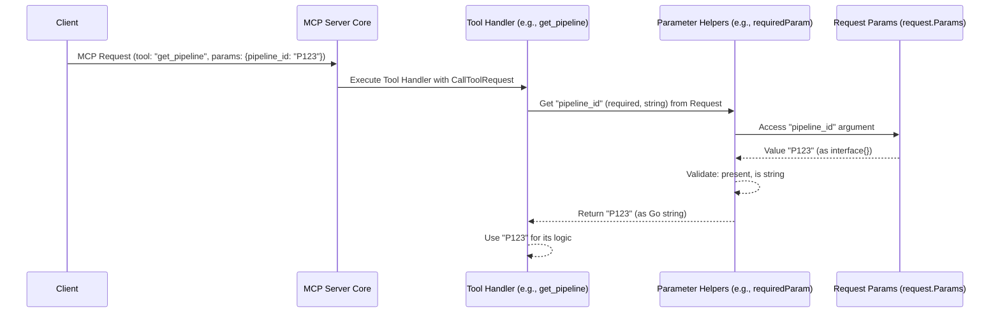

# Chapter 5: Tool Parameter Handling

Welcome to Chapter 5! In [Chapter 4: Scope Management (Account, Org, Project)](04_scope_management__account__org__project__.md), we saw how `mcp-server` figures out the "where" – the correct Harness Account, Organization, and Project for an operation. But tools often need more than just the "where"; they need the "what." For example, if you want to get details for a specific pipeline, the server needs to know *which* pipeline. This is where **Tool Parameter Handling** comes in.

## What's the Big Idea? Giving Instructions to Your Tools

Imagine you're using a coffee machine. To get your perfect cup, you don't just press "start." You might need to tell it:
*   What kind of coffee? (e.g., "espresso" - a specific choice)
*   How strong? (e.g., "medium" - an option)
*   Sugar? (e.g., "yes" or "no" - a boolean choice, maybe with a default of "no")

These choices you make are like **parameters** you give to the coffee machine.

**Tool Parameter Handling** in `mcp-server` is about how individual tools (like the `get_pipeline` tool) receive and understand these specific instructions or pieces of information they need to do their job. Just like a function in programming takes arguments, each tool in `mcp-server` defines what "arguments" (parameters) it expects.

**Use Case: Getting a Specific Pipeline**

Let's say you want `mcp-server` to fetch details for a pipeline with the ID `my_awesome_pipeline`.
1.  The `get_pipeline` tool needs to *know* this ID.
2.  It needs to ensure that an ID is *actually provided* because it's essential for its task.
3.  It needs to make sure the ID is in the correct format (e.g., a piece of text, not a number).

Tool parameter handling is the mechanism that allows the `get_pipeline` tool to clearly state, "I need a `pipeline_id` as text, and it's mandatory!" and then correctly retrieve that ID when you make a request.

## Key Concepts: Parameters Unpacked

Let's break down how tools manage these instructions.

### 1. Parameter Definition: What a Tool Expects

When a [Tool](03_tools_and_toolsets_.md) is created, it formally declares the parameters it can accept. This definition includes:
*   **Name:** The name of the parameter, like `pipeline_id` or `repo_id`. This is what you'll use in your MCP request.
*   **Data Type:** What kind of information is it? A piece of text (string), a whole number (integer/number), a true/false value (boolean), or a list?
*   **Required or Optional:** Does the tool *absolutely need* this parameter to function (required), or can it work without it (optional)?
*   **Default Value (for optional parameters):** If an optional parameter isn't provided, what value should the tool use by default? For example, a `page_size` parameter might default to 10 if you don't specify otherwise.
*   **Description:** A human-readable explanation of what the parameter is for.

This definition is like the label on the coffee machine button ("Strength") and the options available ("Mild," "Medium," "Strong").

### 2. Parameter Extraction: Getting the Values

When the [MCP Server Core](01_mcp_server_core_.md) receives a request and calls a specific tool, the tool's handler function gets access to all the parameters sent by the client. The handler then needs to "extract" the values for the parameters it cares about.

For example, if the `get_pipeline` tool is called, its handler will look for a `pipeline_id` parameter in the incoming request data.

### 3. Validation and Type Conversion: Making Sure It's Right

Once a parameter's value is extracted, a few things happen:
*   **Presence Check:** If a parameter was defined as "required," the system checks if it was actually provided. If not, it usually results in an error.
*   **Type Check/Conversion:** The system checks if the provided value matches the expected data type. For instance, if a tool expects a number for `pr_number` but receives text like "abc", it's an error. Sometimes, a simple conversion might happen (e.g., a JSON number `123` becomes a Go `int` or `float64`).

This ensures the tool gets clean, valid data to work with, preventing unexpected crashes or behavior.

## Solving Our Use Case: Getting `pipeline_id` for `get_pipeline`

Let's revisit our goal: fetching pipeline details for `pipeline_id = "my_awesome_pipeline"`.

1.  **Defining the `pipeline_id` parameter (Tool Definition Time):**
    When the `get_pipeline` tool is defined in `mcp-server` (as seen in `pkg/harness/pipelines.go`), it specifies that it needs a `pipeline_id`:
    ```go
    // Simplified from pkg/harness/pipelines.go
    // ...
    mcp.NewTool("get_pipeline",
        mcp.WithDescription("Get details of a specific pipeline..."),
        mcp.WithString("pipeline_id", // 1. Name: "pipeline_id", Type: String
            mcp.Required(),           // 2. It's Required!
            mcp.Description("The ID of the pipeline"), // 3. Description
        ),
        // ... other options like scope (from [Chapter 4](04_scope_management__account__org__project__.md)) ...
    )
    // ...
    ```
    This tells `mcp-server` that `get_pipeline` expects a string named `pipeline_id` and won't work without it.

2.  **Your MCP Request:**
    You (or a client program) send a request like this:
    ```json
    {
        "tool_name": "get_pipeline",
        "parameters": {
            "org_id": "my_org",         // Scope parameter
            "project_id": "my_project", // Scope parameter
            "pipeline_id": "my_awesome_pipeline" // Our specific tool parameter!
        }
    }
    ```

3.  **Extracting and Validating `pipeline_id` (Inside the Tool Handler):**
    When the `get_pipeline` tool's handler function is executed, it uses helper functions to get the `pipeline_id` value:
    ```go
    // Simplified from the handler in pkg/harness/pipelines.go
    // 'request' is the mcp.CallToolRequest containing the parameters.
    // ...
    pipelineID, err := requiredParam[string](request, "pipeline_id")
    if err != nil {
        // If pipeline_id wasn't provided or was the wrong type,
        // 'err' will be set. Handle the error (e.g., return an error to the client).
        return mcp.NewToolResultError(err.Error()), nil
    }
    // If we're here, 'pipelineID' now holds the string "my_awesome_pipeline"
    // and 'err' is nil. The tool can now use 'pipelineID'.
    // ...
    ```
    The `requiredParam[string](...)` helper does the job of:
    *   Looking for "pipeline_id" in `request.Params`.
    *   Checking if it's present (because it's "required").
    *   Checking if its value is a string.
    *   Returning the string value or an error.

Now, the `get_pipeline` tool has the `pipeline_id` ("my_awesome_pipeline") and can proceed to use the [Harness API Client](06_harness_api_client_.md) to fetch the pipeline details.

## Under the Hood: How Parameters Are Processed

Let's peek at the internal flow.

### Step-by-Step: From Request to Parameter Use

1.  **Client Sends Request:** An MCP request arrives at the [MCP Server Core](01_mcp_server_core_.md). This request includes a `parameters` object (a map of parameter names to values).
2.  **Tool Handler Invoked:** The Server Core identifies the requested tool (e.g., `get_pipeline`) and calls its registered handler function, passing along the `mcp.CallToolRequest` which contains the `parameters`.
3.  **Accessing Parameters:** Inside the tool handler, the `request.Params` field (which is of type `mcp.ToolParameters`) holds the parameters from the client.
4.  **Helper Functions to the Rescue:** The tool handler uses helper functions (like `requiredParam` or `OptionalParam` from `pkg/harness/server.go`) to retrieve specific parameter values.
    *   The helper is given the `request`, the expected parameter `name` (e.g., "pipeline_id"), and sometimes the expected type.
    *   The helper looks up the `name` in `request.Params.Arguments`.
    *   It performs checks: Is it present? Is it the correct type?
    *   It returns the value (converted to the appropriate Go type) or an error.
5.  **Tool Uses Parameter:** If retrieval is successful, the tool handler now has the parameter value in a ready-to-use Go variable.

### Simplified Diagram: Parameter Extraction



### Diving into the Code (Simplified)

Let's look at some key code pieces.

**1. Parameter Definition in Tool Creation (Example from `pkg/harness/pullreq.go`)**

When defining the `GetPullRequestTool`, it declares it needs `repo_id` (string, required) and `pr_number` (number, required).

```go
// Simplified from pkg/harness/pullreq.go
func GetPullRequestTool(config *config.Config, client *client.Client) (mcp.Tool, server.ToolHandlerFunc) {
	return mcp.NewTool("get_pull_request",
			mcp.WithDescription("Get details of a pull request."),
			mcp.WithString("repo_id", // Parameter name
				mcp.Required(),      // It's mandatory!
				mcp.Description("The ID of the repository"),
			),
			mcp.WithNumber("pr_number", // Another parameter
				mcp.Required(),
				mcp.Description("The number of the pull request"),
			),
			// ... scope parameters ...
		),
		func(/* ... */) { /* handler logic */ }
}
```
The `mcp.WithString(...)` and `mcp.WithNumber(...)` functions (from the `mcp-go` library) are used to declare these parameters along with options like `mcp.Required()`. There are similar functions for booleans (`mcp.WithBoolean`), lists, etc., and options for default values (`mcp.DefaultString()`, `mcp.DefaultNumber()`).

**2. Helper Functions for Parameter Extraction (`pkg/harness/server.go`)**

`mcp-server` provides convenient helper functions to get these parameters inside a tool handler.

*   **`requiredParam`**: For parameters that *must* be present.
    ```go
    // Simplified from pkg/harness/server.go
    // T is the expected Go type (e.g., string, float64 for numbers, bool).
    // r is mcp.CallToolRequest, p is the parameter name.
    func requiredParam[T comparable](r mcp.CallToolRequest, p string) (T, error) {
        var zero T // The zero value for type T (e.g., "" for string, 0 for float64)

        val, exists := r.Params.Arguments[p]
        if !exists {
            return zero, fmt.Errorf("missing required parameter: %s", p)
        }

        // Check if the parameter is of the expected type T
        value, ok := val.(T)
        if !ok {
            return zero, fmt.Errorf("parameter %s is not of type %T", p, zero)
        }

        // For some types, also check it's not just the zero value if that implies missing
        if value == zero { // This check might be more nuanced for different types
             return zero, fmt.Errorf("missing required parameter: %s (empty value)", p)
        }
        return value, nil
    }
    ```
    This function checks for existence and type. If `pipeline_id` was expected as a string, `T` would be `string`.

*   **`OptionalParam`**: For parameters that are not mandatory.
    ```go
    // Simplified from pkg/harness/server.go
    func OptionalParam[T any](r mcp.CallToolRequest, p string) (T, error) {
        var zero T

        val, exists := r.Params.Arguments[p]
        if !exists {
            return zero, nil // Not present, return zero value, no error
        }

        value, ok := val.(T)
        if !ok {
            // Present but wrong type
            return zero, fmt.Errorf("parameter %s is not of type %T", p, zero)
        }
        return value, nil // Present and correct type
    }
    ```
    This function returns the parameter's value if present and of the correct type, or the "zero value" (e.g., `""` for string, `0` for int, `false` for bool) if not present, without an error for non-presence.

**3. Using Helpers in a Tool Handler (Example from `pkg/harness/pullreq.go`)**

The `GetPullRequestTool`'s handler uses `requiredParam` to fetch `repo_id` and `pr_number`.

```go
// Simplified handler from GetPullRequestTool in pkg/harness/pullreq.go
func(ctx context.Context, request mcp.CallToolRequest) (*mcp.CallToolResult, error) {
    // Get required string parameter "repo_id"
    repoID, err := requiredParam[string](request, "repo_id")
    if err != nil {
        return mcp.NewToolResultError(err.Error()), nil // Return error if missing/wrong type
    }

    // Get required number parameter "pr_number" (MCP numbers are often float64)
    prNumberFloat, err := requiredParam[float64](request, "pr_number")
    if err != nil {
        return mcp.NewToolResultError(err.Error()), nil
    }
    prNumber := int(prNumberFloat) // Convert to int if needed

    // ... now use repoID and prNumber ...
    return mcp.NewToolResultText("Got PR!"), nil
}
```
And `ListPullRequestsTool` uses `OptionalParam` for filters like `state` or `query`:
```go
// Simplified handler from ListPullRequestsTool in pkg/harness/pullreq.go
func(ctx context.Context, request mcp.CallToolRequest) (*mcp.CallToolResult, error) {
    // ...
    // Get optional string parameter "state"
    stateStr, err := OptionalParam[string](request, "state")
    if err != nil { // Error only if type is wrong, not if missing
        return mcp.NewToolResultError(err.Error()), nil
    }
    // if stateStr is "", it means the parameter wasn't provided or was empty.
    // if stateStr is "open,merged", then use it.
    if stateStr != "" {
        // ... parse stateStr ...
    }
    // ...
    return mcp.NewToolResultText("Listed PRs!"), nil
}
```

**Pagination Parameters: A Special Case (`pkg/harness/pagination.go`)**

Sometimes, a group of parameters is common across many tools, like for pagination (`page` and `size`). `mcp-server` handles this by:
1.  Defining a reusable `mcp.ToolOption` called `WithPagination()` that adds `page` and `size` parameter definitions to any tool.
    ```go
    // Simplified from pkg/harness/pagination.go
    func WithPagination() mcp.ToolOption {
        return func(tool *mcp.Tool) {
            mcp.WithNumber("page", /* ... default 0 ... */)(tool)
            mcp.WithNumber("size", /* ... default 5 ... */)(tool)
        }
    }
    ```
    This is used when defining tools like `ListPipelinesTool`.

2.  Providing a helper function `fetchPagination()` to extract these values.
    ```go
    // Simplified from pkg/harness/pagination.go
    func fetchPagination(request mcp.CallToolRequest) (page, size int, err error) {
        // Uses OptionalIntParamWithDefault (another helper in pkg/harness/server.go)
        pageVal, errP := OptionalIntParamWithDefault(request, "page", 0)
        // ... error handling ...
        sizeVal, errS := OptionalIntParamWithDefault(request, "size", 5)
        // ... error handling ...
        return pageVal, sizeVal, nil
    }
    ```
This pattern keeps tool definitions cleaner and parameter extraction consistent.

## Conclusion

Tool Parameter Handling is like the instruction manual for each tool in `mcp-server`. It ensures that:
*   Tools clearly define what information they need (name, type, if it's required).
*   Tools can reliably get this information from your requests.
*   Basic checks are done to make sure the information is valid.

This system makes tools robust and predictable. By defining parameters, tools declare their "contract" with the client, ensuring they receive the necessary inputs to perform their specific functions within the correct [Scope](04_scope_management__account__org__project__.md).

Now that we understand how tools get their specific instructions and the context (scope) to operate in, we're ready to see what they *do* with that information. Often, it involves talking to Harness itself. In the next chapter, we'll explore the [Harness API Client](06_harness_api_client_.md), the component responsible for these communications.