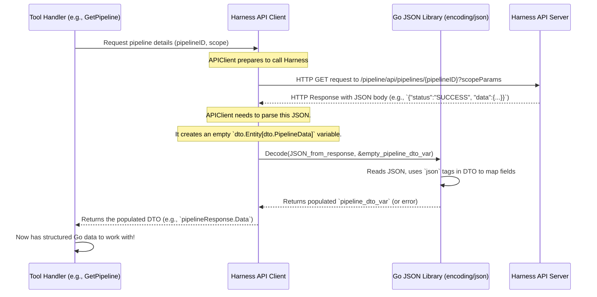

# Chapter 7: Data Transfer Objects (DTOs)

In [Chapter 6: Scope Handling](06_scope_handling_.md), we saw how `harness-mcp` figures out the correct "address" (Account, Organization, Project) for its operations within the Harness platform. This ensures our [Harness API Client](05_harness_api_client_.md) talks to the right part of Harness. But what about the actual information, the "packages" of data, that are exchanged? When `harness-mcp` asks Harness for pipeline details, or tells Harness to create a pull request, how is that data structured?

This is where **Data Transfer Objects (DTOs)** come into play. They are the official "shipping manifests" or "blueprints" for all data moving between `harness-mcp` and Harness.

## What's the Data Format? The Problem DTOs Solve

Imagine our `harness-mcp` server wants to fetch information about a specific pipeline. The [Harness API Client](05_harness_api_client_.md) sends a request to Harness, and Harness replies with details about that pipeline. This data usually arrives in a format called JSON (JavaScript Object Notation), which is text-based and human-readable, but not directly usable by our Go program.

```json
// Example JSON for a pipeline from Harness (simplified)
{
  "status": "SUCCESS",
  "data": {
    "yamlPipeline": "pipeline:\n  name: My Awesome Pipeline\n  identifier: my_awesome_pipeline\n...",
    "gitDetails": {
      "valid": true
    },
    "modules": ["ci", "cd"]
  }
}
```

Our Go server needs to:
1.  **Understand this JSON**: Know that there's a `status` field, a `data` field, and inside `data`, there's `yamlPipeline`, `gitDetails`, etc.
2.  **Convert it**: Transform this JSON text into Go data types (like strings, booleans, lists) that the rest of the `harness-mcp` code can work with easily and safely.

Similarly, if `harness-mcp` wants to *create* a pull request, it needs to send JSON data *to* Harness in a specific format that Harness expects.

DTOs solve this by defining Go structures that precisely match these JSON formats.

## Data Blueprints: What are DTOs?

A **Data Transfer Object (DTO)** in `harness-mcp` is a Go structure (`struct`) that acts as a blueprint for the data exchanged with Harness APIs.

Think of them like this:
*   **Standardized Shipping Manifests**: When Harness sends data, the DTO is like a manifest that lists all the items in the shipment (e.g., `pipelineName`, `pipelineID`, `status`) and their types. `harness-mcp` uses this manifest to "unpack" the data correctly.
*   **Blueprints for Construction**: When `harness-mcp` needs to send data to Harness (like instructions to build a new pull request), it uses a DTO as a blueprint to construct the data package in the exact format Harness expects.

Key roles of DTOs:
*   **Defining Structure**: They clearly define what fields are expected in the data (e.g., a pipeline has an `identifier`, a `name`, `gitDetails`, etc.).
*   **Enabling Parsing (Unmarshaling)**: When `harness-mcp` receives JSON data from Harness, it uses the corresponding DTO to automatically convert (or "unmarshal") the JSON into a Go struct instance.
*   **Enabling Formatting (Marshaling)**: When `harness-mcp` needs to send data to Harness, it populates a DTO struct instance with Go data, and then automatically converts (or "marshals") that struct into JSON.

This ensures that data sent to Harness is correctly structured and that data received from Harness can be reliably understood and used by the server.

## How DTOs are Used

DTOs are primarily used by the [Harness API Client](05_harness_api_client_.md) when it interacts with Harness APIs. They live in the `client/dto/` directory of the `harness-mcp` project.

### 1. Receiving Data from Harness (Unmarshaling)

Let's say the [Harness API Client](05_harness_api_client_.md) fetches pipeline details. Harness returns JSON.
The API client needs a Go struct blueprint to make sense of this. This blueprint is a DTO, for example, `dto.Entity[dto.PipelineData]`.

**The DTO Blueprint (`client/dto/pipeline.go`):**
Here's a very simplified version of what `dto.PipelineData` and its container `dto.Entity` might look like. Notice the `json:"..."` tags – these tell Go's JSON library how to map JSON fields to struct fields.

```go
// Simplified from client/dto/pipeline.go

package dto

// Entity is a generic container for API responses
type Entity[T any] struct {
	Status string `json:"status,omitempty"` // e.g., "SUCCESS"
	Data   T      `json:"data,omitempty"`   // The actual data payload
}

// PipelineData represents the core data of a pipeline
type PipelineData struct {
	YamlPipeline string     `json:"yamlPipeline,omitempty"`
	GitDetails   GitDetails `json:"gitDetails,omitempty"`
	// ... other fields like Modules, StoreType ...
}

// GitDetails nested within PipelineData
type GitDetails struct {
	Valid       bool   `json:"valid,omitempty"`
	InvalidYaml string `json:"invalidYaml,omitempty"`
}
```
*   `Entity[T any]`: This is a generic struct often used by Harness APIs. `T` can be any type, like `PipelineData`.
*   `PipelineData`: Defines fields like `YamlPipeline` (a string) and `GitDetails` (another struct).
*   `json:"yamlPipeline,omitempty"`: This "tag" tells Go's JSON package:
    *   When reading JSON, look for a field named `yamlPipeline` and put its value into the `YamlPipeline` struct field.
    *   When writing this struct to JSON, use `yamlPipeline` as the JSON field name.
    *   `omitempty` means if the Go struct field has its zero value (e.g., empty string for a string), don't include it in the JSON output (useful when sending data).

**The "Unpacking" Process (Unmarshaling):**
When the [Harness API Client](05_harness_api_client_.md) receives the JSON response for pipeline details, it does something like this (simplified from `client/client.go`'s `Get` method):

```go
// Simplified: Inside the API Client's Get method
var pipelineResponse dto.Entity[dto.PipelineData] // Create an empty DTO instance

// httpResp.Body contains the JSON data from Harness
// json.NewDecoder(...).Decode(...) reads the JSON and fills 'pipelineResponse'
err := json.NewDecoder(httpResp.Body).Decode(&pipelineResponse)
if err != nil {
    // Handle error: the JSON didn't match the DTO blueprint!
}

// Now, 'pipelineResponse' is filled with data!
// We can access it like:
// pipelineYAML := pipelineResponse.Data.YamlPipeline
// isGitValid := pipelineResponse.Data.GitDetails.Valid
```
The `json.Decode(&pipelineResponse)` line is where the magic happens. Go's JSON library uses the `dto.Entity[dto.PipelineData]` blueprint to parse the incoming JSON and populate the `pipelineResponse` variable.

### 2. Sending Data to Harness (Marshaling)

Now, let's say a tool in `harness-mcp` wants to create a new pull request. It needs to construct the data in the format Harness expects.

**The DTO Blueprint (`client/dto/pullrequest.go`):**
A DTO like `dto.CreatePullRequest` defines the blueprint for the data needed to create a PR.

```go
// Simplified from client/dto/pullrequest.go
package dto

// CreatePullRequest defines the data needed to create a new pull request
type CreatePullRequest struct {
	Title        string `json:"title"`                 // Mandatory
	Description  string `json:"description,omitempty"` // Optional
	SourceBranch string `json:"source_branch"`         // Mandatory
	TargetBranch string `json:"target_branch"`         // Mandatory
}
```

**The "Packing" Process (Marshaling):**
A tool (e.g., `CreatePullRequestTool`) would first create an instance of this DTO and fill it:

```go
// Simplified: Inside a tool handler
prData := dto.CreatePullRequest{
	Title:        "Add New Super Feature",
	SourceBranch: "feature/super",
	TargetBranch: "main",
	Description:  "This feature does amazing things!",
}

// Now, the API Client needs to send this to Harness.
// It will convert 'prData' into JSON.
// Simplified from client/client.go's Post method:
jsonData, err := json.Marshal(prData)
if err != nil {
    // Handle error
}

// 'jsonData' now contains a byte slice of JSON:
// {
//   "title": "Add New Super Feature",
//   "source_branch": "feature/super",
//   "target_branch": "main",
//   "description": "This feature does amazing things!"
// }
// This JSON is then sent in the HTTP request body to Harness.
```
The `json.Marshal(prData)` call converts the Go `prData` struct into a JSON string, following the blueprint defined by `dto.CreatePullRequest` and its `json` tags.

## Under the Hood: How DTOs Facilitate Data Exchange

Let's visualize the flow when `harness-mcp` fetches pipeline information using a DTO.



The DTOs themselves are just Go struct definitions. You can find them in the `client/dto/` directory. For example:
*   `client/dto/pipeline.go`: Contains DTOs related to pipelines, like `PipelineData`, `PipelineListItem`, `PipelineExecution`.
*   `client/dto/pullrequest.go`: Contains DTOs for pull requests, like `PullRequest`, `CreatePullRequest`, `PullRequestCheck`.
*   `client/dto/repositories.go`: For repository information, like `Repository`.
*   `client/dto/common.go` (or similar, if it exists, sometimes common structures like `ErrorResponse` or pagination info are here, though in `harness-mcp` they might be within specific files like `pipeline.go` for `ListOutput`).

Let's look at a small snippet from `client/dto/pullrequest.go` to see more DTOs.
```go
// From client/dto/pullrequest.go
package dto

// PullRequest represents a pull request in the system
type PullRequest struct {
	Number       int               `json:"number,omitempty"`
	Title        string            `json:"title,omitempty"`
	State        string            `json:"state,omitempty"` // e.g., "OPEN", "MERGED", "CLOSED"
	SourceBranch string            `json:"source_branch,omitempty"`
	TargetBranch string            `json:"target_branch,omitempty"`
	Author       PullRequestAuthor `json:"author,omitempty"` // Nested DTO
	Created      int64             `json:"created,omitempty"` // Timestamp
	// ... many other fields ...
}

// PullRequestAuthor represents a user in the pull request system
type PullRequestAuthor struct {
	DisplayName string `json:"display_name,omitempty"`
	Email       string `json:"email,omitempty"`
	UID         string `json:"uid,omitempty"`
	// ... other fields ...
}
```
These structs are designed to precisely mirror the JSON structure that the Harness Code Repository module (for pull requests) sends and receives. The `json` tags are critical for the Go `encoding/json` package to automatically handle the conversion.

## Why are DTOs Important?

Using DTOs provides several key benefits:

1.  **Type Safety**: Go is a statically-typed language. DTOs bring this safety to API interactions. When you unmarshal JSON into a DTO, if the JSON is malformed or a field is of the wrong type (e.g., a string where a number is expected based on the DTO), the Go JSON library will often report an error. The Go compiler can also catch errors if you try to access a field on a DTO that doesn't exist (e.g., `myPipeline.NonExistentField`).
2.  **Clarity and Documentation**: DTOs serve as clear, code-based documentation for the data structures. By looking at a DTO like `dto.PipelineData`, a developer can quickly understand what information a pipeline object contains.
3.  **Ease of Use (Developer Experience)**: Manually parsing complex JSON is tedious and error-prone. DTOs, combined with Go's `encoding/json` package, make this process almost automatic and much more robust.
4.  **Consistency**: They ensure that both `harness-mcp` (the client) and Harness (the server) have a shared understanding of the data format, reducing misinterpretations.
5.  **Refactoring and Maintenance**: If the Harness API changes a field name or data type, you often only need to update the DTO in `harness-mcp`. The Go compiler can then help identify parts of the code that need adjustment, making maintenance easier.

## Conclusion

Data Transfer Objects (DTOs) are the unsung heroes that make communication between `harness-mcp` and the Harness APIs smooth and reliable. They act as precise blueprints or "shipping manifests" for the data, defining the expected structure with Go structs and `json` tags. This allows `harness-mcp` to easily convert JSON data from Harness into usable Go objects (unmarshaling) and to convert Go objects into the correct JSON format for sending data to Harness (marshaling).

By defining the "what" (the data structures) of API communication, DTOs complement the "where" (from [Chapter 6: Scope Handling](06_scope_handling_.md)) and the "how" (from the [Harness API Client](05_harness_api_client_.md)), ensuring that `harness-mcp` can effectively interact with the full breadth of Harness functionalities.

This chapter concludes our core journey through the `harness-mcp` project's fundamental concepts! You've learned about its Tools and Toolsets, the MCP Server Core, how it's launched and configured, how it communicates with Harness APIs, how it handles scope, and now, how it manages the data structures for those communications. With this foundation, you're well-equipped to understand how `harness-mcp` works and potentially contribute to its development.