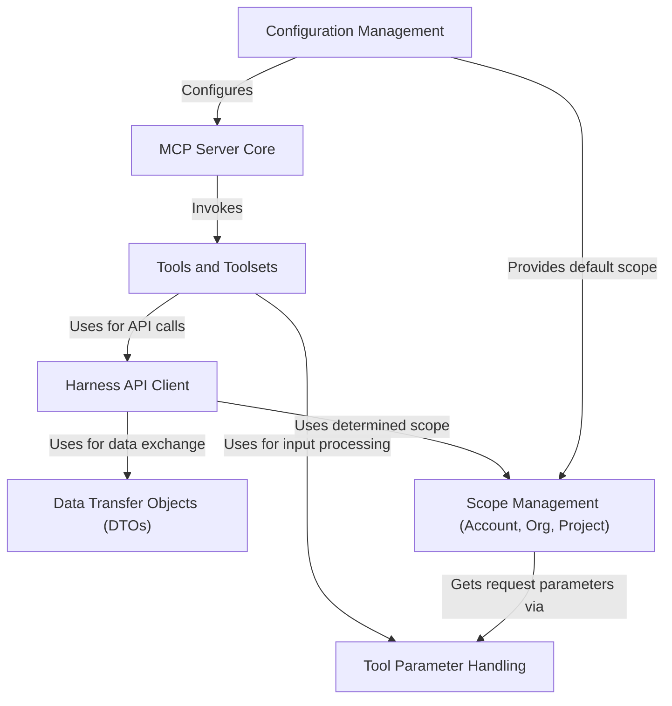

# Tutorial: mcp-server

The `mcp-server` project is a **server application** designed to let other programs, like AI assistants, easily interact with the *Harness platform*.
It works by listening for requests written in a specific format (the **Model Context Protocol** or MCP).
When it gets a request, it uses one of its built-in **Tools**—like a tool to 'get pipeline details' or 'list pull requests'—to perform the requested action in Harness and then sends back the result.

**Source Repository:** [None](None)

## Chapters

1. [MCP Server Core
](01_mcp_server_core_.md)
2. [Configuration Management
](02_configuration_management_.md)
3. [Tools and Toolsets
](03_tools_and_toolsets_.md)
4. [Scope Management (Account, Org, Project)
](04_scope_management__account__org__project__.md)
5. [Tool Parameter Handling
](05_tool_parameter_handling_.md)
6. [Harness API Client
](06_harness_api_client_.md)
7. [Data Transfer Objects (DTOs)
](07_data_transfer_objects__dtos__.md)