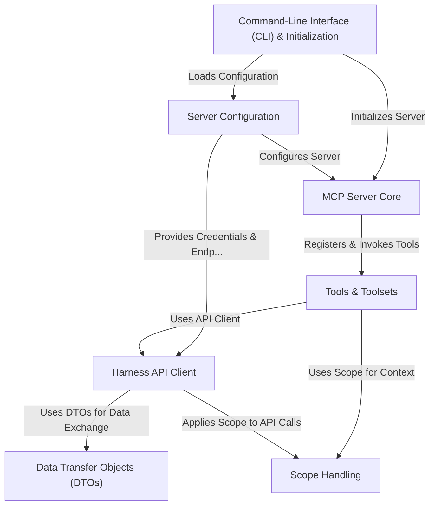

# Tutorial: harness-mcp

The `harness-mcp` project provides a **server** that implements the *Model Context Protocol (MCP)*.
This server acts as an intermediary, allowing AI assistants or other MCP-compatible clients to interact with various **Harness platform APIs**.
It achieves this by exposing specific Harness functionalities, such as managing pipelines, pull requests, or repositories, as invokable **tools**.
This enables developers and tools to automate tasks and integrate with Harness features through a standardized communication protocol.

**Source Repository:** [None](None)

## Chapters

1. [Tools & Toolsets
](01_tools___toolsets_.md)
2. [MCP Server Core
](02_mcp_server_core_.md)
3. [Command-Line Interface (CLI) & Initialization
](03_command_line_interface__cli____initialization_.md)
4. [Server Configuration
](04_server_configuration_.md)
5. [Harness API Client
](05_harness_api_client_.md)
6. [Scope Handling
](06_scope_handling_.md)
7. [Data Transfer Objects (DTOs)
](07_data_transfer_objects__dtos__.md)